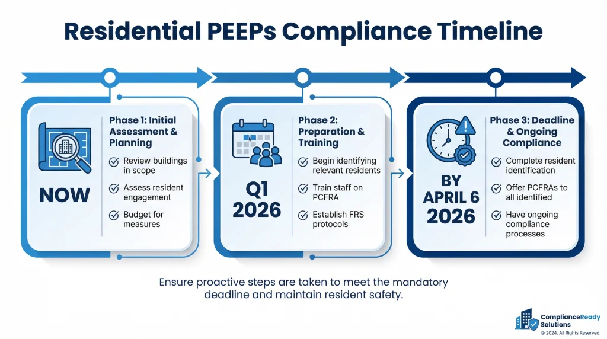

In 2026, residential building owners across England face the most significant fire safety regulatory change since the Grenfell Tower Inquiry. The Fire Safety (Residential Evacuation Plans) (England) Regulations 2025 come into force on 6 April 2026, mandating Personal Emergency Evacuation Plans (PEEPs) for approximately 12,500 high-rise buildings nationwide ([Tetra Consulting](https://tetraconsulting.co.uk/residential-peeps-what-property-managers-need-to-know-tetra-consulting/), 2026).

The stakes are high. Fire safety prosecutions in England rose 79% in 2023/24, with £1.4 million in fines issued for non-compliance ([Fire Marshal Training](https://www.firemarshaltraining.co.uk/blog/fire-safety-prosecution-statistics-uk), 2025). With only months until the deadline, property managers, freeholders, and Responsible Persons need to act now.

> **Key Takeaways**
>
> - Approximately 12,500 buildings in England are 18m+ and must comply by April 2026 ([Tetra Consulting](https://tetraconsulting.co.uk/residential-peeps-what-property-managers-need-to-know-tetra-consulting/), 2026)
> - Fire safety prosecutions rose 79% in 2023/24 with £1.4m in fines ([Fire Marshal Training](https://www.firemarshaltraining.co.uk/blog/fire-safety-prosecution-statistics-uk), 2025)
> - 36% of UK households include someone with a disability ([Parliamentary Committee](https://publications.parliament.uk/pa/cm5804/cmselect/cmcomloc/63/report.html), 2024)
> - Non-compliance can result in unlimited fines or imprisonment ([London Fire Brigade](https://www.london-fire.gov.uk/safety/the-workplace/fire-safety-law-explained/), 2025)

## Which Buildings Are Affected by the April 2026 Deadline?

The Fire Safety (Residential Evacuation Plans) (England) Regulations 2025 apply to residential buildings in England that meet specific height thresholds ([Kent Fire & Rescue](https://www.kent.fire-uk.org/new-safety-rules-some-residential-buildings-6-april-2026), 2026). As of January 2026, approximately 12,500 buildings in England are 18 metres or taller, with an estimated 65,000 buildings exceeding 11 metres ([Tetra Consulting](https://tetraconsulting.co.uk/residential-peeps-what-property-managers-need-to-know-tetra-consulting/), 2026).

**Buildings covered by the new regulations:**

- High-rise residential buildings: 18 metres or 7 storeys above ground level
- Medium-rise residential buildings: 11 metres or height specified in future regulations
- Buildings with sleeping accommodation (care homes, student housing)
- Mixed-use buildings with residential units

The regulations require Responsible Persons to identify residents who may struggle to self-evacuate and develop person-centred fire risk assessments (PCFRAs) for each vulnerable individual ([Cheshire Fire](https://www.cheshirefire.gov.uk/fire-protection/business-owner-landlord-or-employee/fire-safety-residential-evacuation-plans-england-regulations-2025/), 2026).

According to the government's impact assessment, disabled residents are disproportionately affected by fire incidents. At Grenfell Tower, 40% of those who died were disabled people, despite comprising approximately 13% of the population ([Fire Protection Association](https://www.thefpa.co.uk/news/fire-safety-and-disability), 2025). These regulations directly address that disparity.

<BlogCTA
  label="Book a fire risk assessment for your residential building"
  href="/services/fire-risk-assessment/high-rise-buildings"
/>

## What Are Residential Personal Emergency Evacuation Plans (PEEPs)?

Residential PEEPs are individualised evacuation plans for residents who may need assistance to escape a fire safely. Unlike generic fire procedures, PEEPs are tailored to each person's specific needs, considering mobility limitations, sensory impairments, cognitive conditions, and temporary factors like pregnancy or recovery from surgery ([GOV.UK](https://www.gov.uk/government/publications/residential-personal-emergency-evacuation-plans-residential-peeps/residential-peeps-guidance-for-responsible-persons), 2025).

The new regulations introduce two key documents:

**Residential Personal Emergency Evacuation Plans (RPEEPs):** Detailed plans for individual residents, developed through person-centred consultations. These must include the resident's specific needs, required assistance, evacuation routes, and any equipment needed (such as evacuation chairs or communication aids).

**Person-Centred Fire Risk Assessments (PCFRAs):** Systematic assessments that evaluate each resident's ability to evacuate independently. PCFRAs identify reasonable and proportionate mitigation measures, balancing safety improvements with practical feasibility ([Cheshire Fire](https://www.cheshirefire.gov.uk/fire-protection/business-owner-landlord-or-employee/fire-safety-residential-evacuation-plans-england-regulations-2025/), 2026).

About 10% of the UK population has a mobility impairment, and 7.5% experience stamina or breathing difficulties ([GOV.UK](https://www.gov.uk/government/publications/fire-safety-means-of-escape-for-disabled-people/fire-safety-means-of-escape-for-disabled-people-executive-summary), 2025). In multi-storey residential buildings, these residents face disproportionate risk during evacuations.

<InsightBox type="unique-insight">
  The compliance challenge isn't just identifying vulnerable residents—it's the
  "moving target" problem. Student accommodation sees annual turnover, general
  needs housing sees regular tenancy changes, and ageing residents develop new
  mobility issues over time. Smart property managers are building PEEP processes
  into their standard tenancy onboarding and annual review cycles, treating
  evacuation planning as ongoing operational practice, not a one-time compliance
  project.
</InsightBox>

<RawHTML
  html={`<figure style="margin: 2.5rem 0; text-align: center; padding: 1.5rem; background: #1a1a2e; border-radius: 12px;">
  <svg
    viewBox="0 0 560 380"
    xmlns="http://www.w3.org/2000/svg"
    style="max-width: 100%; height: auto;"
  >
    <text
      x="280"
      y="40"
      text-anchor="middle"
      fill="#ffffff"
      font-size="22"
      font-weight="bold"
    >
      England Residential Buildings by Height (2026)
    </text>
    <g transform="translate(60, 80)">
      <rect x="0" y="0" width="440" height="50" fill="#ef4444" rx="4" />
      <text
        x="220"
        y="32"
        text-anchor="middle"
        fill="#ffffff"
        font-size="16"
        font-weight="600"
      >
        18m+ (High-Rise): 12,500 buildings
      </text>
      <rect x="0" y="70" width="300" height="50" fill="#f97316" rx="4" />
      <text
        x="150"
        y="102"
        text-anchor="middle"
        fill="#ffffff"
        font-size="16"
        font-weight="600"
      >
        11-18m (Mid-Rise): 52,500 buildings
      </text>
      <rect x="0" y="140" width="176" height="50" fill="#22c55e" rx="4" />
      <text
        x="88"
        y="172"
        text-anchor="middle"
        fill="#ffffff"
        font-size="16"
        font-weight="600"
      >
        Under 11m: Not affected
      </text>
      <text x="0" y="240" fill="#e2e8f0" font-size="14">
        Total affected buildings: ~65,000
      </text>
      <text x="0" y="270" fill="#f97316" font-size="15" font-weight="600">
        PEEPs mandatory for 18m+ from April 2026
      </text>
    </g>
  </svg>
  

    Source: Tetra Consulting Analysis 2026, GOV.UK Building Safety Data
  

</figure>`}
/>

According to the regulations, PEEPs must be proportionate to the level of risk and the resident's needs. Not every mitigation measure requires expensive equipment—many solutions involve procedural changes, communication improvements, or staff training ([GOV.UK](https://www.gov.uk/government/publications/residential-personal-emergency-evacuation-plans-residential-peeps/residential-peeps-factsheet), 2025).

## What Are the Legal Duties for Responsible Persons?

From 6 April 2026, Responsible Persons must fulfil several specific legal duties under the Fire Safety (Residential Evacuation Plans) (England) Regulations 2025 ([GOV.UK](https://www.legislation.gov.uk/uksi/2025/797/contents/made), 2025). Failure to comply can result in unlimited fines or up to two years in custody for serious breaches ([Sheffield NHS](https://www.sheffieldpartnership.nhs.uk/sites/default/files/2020-05/Fire%20Safety%20Protocol%2006%20-%20Regulatory%20Reform%20%28Fire%20Safety%29%20Order%202005%20Summary.pdf), 2025).

**Core legal duties include:**

1. **Identify relevant residents:** Proactively identify all residents who may need support to evacuate, including those with mobility impairments, sensory disabilities, cognitive conditions, or temporary limitations.

2. **Complete Person-Centred Fire Risk Assessments (PCFRAs):** Conduct individual assessments for each relevant resident, evaluating their specific evacuation needs and the building's features that affect escape routes.

3. **Develop Residential PEEPs:** Create personalised evacuation plans that specify how each resident will be assisted, who will provide assistance, what equipment is needed, and what procedures will be followed.

4. **Provide information to Fire and Rescue Services:** Share building-level evacuation information with local fire services, including floor plans, locations of vulnerable residents, and details of evacuation equipment.

5. **Inform residents and staff:** Ensure all residents are aware of the evacuation procedures, and staff members receive appropriate training on PEEP implementation.

The Responsible Person is typically the building owner, freeholder, or managing agent. In buildings with multiple Responsible Persons (such as mixed tenure blocks), duties are shared, and cooperation is required ([Bedfordshire Fire](https://www.bedsfire.gov.uk/news/new-fire-safety-regulations-strengthen-evacuation-planning), 2026).

Fire and Rescue Services completed 51,020 fire safety audits in England in the year ending March 2025, with 42% resulting in unsatisfactory outcomes ([GOV.UK](https://www.gov.uk/government/statistics/fire-prevention-and-protection-england-year-ending-march-2025/fire-prevention-and-protection-statistics-england-april-2024-to-march-2025), 2025). With heightened focus on residential evacuation planning, enforcement activity is expected to increase significantly after April 2026.

[Understand your full fire safety legal obligations](/services/fire-risk-assessment)

## How to Implement PEEPs Before the April 2026 Deadline

Implementing Residential PEEPs requires systematic planning and execution. Following this step-by-step approach will help ensure compliance before the April 2026 deadline.

### Step 1: Conduct a Building-Wide Risk Assessment

Before identifying individual residents, assess your building's evacuation infrastructure. Review escape routes, fire detection systems, firefighting equipment, and building features that affect evacuation ([GOV.UK](https://www.gov.uk/government/publications/fire-safety-risk-assessment-means-of-escape-for-disabled-people/fire-safety-risk-assessment-means-of-escape-for-disabled-people-accessible-version), 2025).

**Key assessment elements:**

- Floor plans showing primary and secondary escape routes
- Location of fire doors, stairwells, and evacuation equipment
- Fire alarm system coverage and capability
- Existing evacuation procedures and signage
- Building construction and fire-rated compartments

This baseline assessment provides the foundation for individual PEEPs and helps identify building-level improvements that may be needed.

### Step 2: Identify and Engage with Residents

Proactively identify residents who may need evacuation assistance. This includes visible disabilities (wheelchair users, mobility impairments) and non-visible conditions (hearing or visual impairments, cognitive conditions, heart conditions, respiratory issues).

36% of UK households include at least one member with a disability, rising from 34% in 2019-20 ([Parliamentary Committee](https://publications.parliament.uk/pa/cm5804/cmselect/cmcomloc/63/report.html), 2024). Don't rely on self-disclosure alone—use tenancy records, regular communication, and respectful direct engagement.

**Engagement best practices:**

- Send personalised communications explaining the new requirements
- Offer private consultation options (in-home, video, telephone)
- Emphasise that PEEPs improve safety for all residents
- Ensure confidentiality and dignity throughout the process

### Step 3: Complete Person-Centred Fire Risk Assessments

For each relevant resident, complete a PCFRA that evaluates their specific needs. The assessment should consider ([Cheshire Fire](https://www.cheshirefire.gov.uk/fire-protection/business-owner-landlord-or-employee/fire-safety-residential-evacuation-plans-england-regulations-2025/), 2026):

- **Mobility:** Can they use stairs independently? Do they use mobility aids?
- **Sensory:** Can they hear fire alarms? Can they see emergency signage?
- **Cognitive:** Can they understand and follow evacuation procedures independently?
- **Temporary factors:** Surgery, pregnancy, injury, or medication side effects
- **Assistance network:** Family, carers, or neighbours who can help

The assessment must be "person-centred"—engaging directly with the resident about their needs rather than making assumptions based on medical categories.

### Step 4: Develop Individual PEEPs

Create a written PEEP for each relevant resident. The plan should specify ([GOV.UK](https://www.gov.uk/government/publications/residential-personal-emergency-evacuation-plans-residential-peeps/residential-peeps-guidance-for-responsible-persons), 2025):

- The resident's evacuation route from their flat to the assembly point
- What assistance they need and who will provide it
- Any equipment required (evacuation chair, communication aids, etc.)
- Alternative procedures if primary routes are blocked
- How the resident will be alerted to a fire
- Staff responsibilities and training requirements

PEEPs must be "reasonable and proportionate"—not every measure is practical or necessary. Focus on solutions that deliver meaningful safety improvements within realistic constraints.

### Step 5: Implement Building-Level Improvements

Individual PEEPs may reveal building-level improvements needed. Common enhancements include ([GOV.UK](https://www.gov.uk/government/publications/residential-personal-emergency-evacuation-plans-residential-peeps/residential-peeps-factsheet), 2025):

- Installing evacuation chairs or lifts on key floors
- Enhancing fire alarm systems (visual alerts, tactile devices)
- Improving escape route signage and lighting
- Upgrading fire doors to relevant compartments
- Providing two-way communication systems

Costs for "mitigating measures" can only be charged to all residents through service charges if the measures benefit most residents—not just the individual ([GOV.UK](https://www.lease-advice.org/building-management/fire-safety/fire-safety-for-directors/residential-peeps/), 2026). Building-wide improvements typically qualify, while individual equipment usually remains the Responsible Person's responsibility.

<RawHTML
  html={`<figure style="margin: 2.5rem 0; text-align: center; padding: 1.5rem; background: #1a1a2e; border-radius: 12px;">
  <svg
    viewBox="0 0 600 440"
    xmlns="http://www.w3.org/2000/svg"
    style="max-width: 100%; height: auto;"
  >
    <text
      x="300"
      y="40"
      text-anchor="middle"
      fill="#ffffff"
      font-size="20"
      font-weight="bold"
    >
      PEEP Implementation Timeline (Pre-Deadline)
    </text>
    <line
      x1="100"
      y1="80"
      x2="100"
      y2="350"
      stroke="#475569"
      stroke-width="2"
      stroke-dasharray="4"
    />
    <g transform="translate(20, 70)">
      <text x="0" y="15" fill="#e2e8f0" font-size="13" font-weight="600">
        Phase 1
      </text>
      <text x="0" y="35" fill="#94a3b8" font-size="11">
        Nov–Dec 2025
      </text>
      <rect x="100" y="2" width="160" height="34" fill="#ef4444" rx="6" />
      <text
        x="180"
        y="24"
        text-anchor="middle"
        fill="#ffffff"
        font-size="12"
        font-weight="600"
      >
        Building assessment
      </text>
      <text x="0" y="75" fill="#e2e8f0" font-size="13" font-weight="600">
        Phase 2
      </text>
      <text x="0" y="95" fill="#94a3b8" font-size="11">
        Jan 2026
      </text>
      <rect x="100" y="62" width="160" height="34" fill="#f97316" rx="6" />
      <text
        x="180"
        y="84"
        text-anchor="middle"
        fill="#ffffff"
        font-size="12"
        font-weight="600"
      >
        Identify residents
      </text>
      <text x="0" y="135" fill="#e2e8f0" font-size="13" font-weight="600">
        Phase 3
      </text>
      <text x="0" y="155" fill="#94a3b8" font-size="11">
        Feb 2026
      </text>
      <rect x="100" y="122" width="160" height="34" fill="#eab308" rx="6" />
      <text
        x="180"
        y="144"
        text-anchor="middle"
        fill="#ffffff"
        font-size="12"
        font-weight="600"
      >
        Complete PCFRAs
      </text>
      <text x="0" y="195" fill="#e2e8f0" font-size="13" font-weight="600">
        Phase 4
      </text>
      <text x="0" y="215" fill="#94a3b8" font-size="11">
        Mar 2026
      </text>
      <rect x="100" y="182" width="160" height="34" fill="#22c55e" rx="6" />
      <text
        x="180"
        y="204"
        text-anchor="middle"
        fill="#ffffff"
        font-size="12"
        font-weight="600"
      >
        Write PEEPs
      </text>
      <text x="280" y="15" fill="#e2e8f0" font-size="13" font-weight="600">
        Phase 5
      </text>
      <text x="280" y="35" fill="#94a3b8" font-size="11">
        Late Mar 2026
      </text>
      <rect x="380" y="2" width="160" height="34" fill="#3b82f6" rx="6" />
      <text
        x="460"
        y="24"
        text-anchor="middle"
        fill="#ffffff"
        font-size="12"
        font-weight="600"
      >
        Install equipment
      </text>
      <text x="280" y="75" fill="#e2e8f0" font-size="13" font-weight="600">
        Phase 6
      </text>
      <text x="280" y="95" fill="#94a3b8" font-size="11">
        Early Apr 2026
      </text>
      <rect x="380" y="62" width="160" height="34" fill="#3b82f6" rx="6" />
      <text
        x="460"
        y="84"
        text-anchor="middle"
        fill="#ffffff"
        font-size="12"
        font-weight="600"
      >
        Staff training
      </text>
      <rect x="100" y="240" width="440" height="42" fill="#ef4444" rx="6" />
      <text
        x="320"
        y="266"
        text-anchor="middle"
        fill="#ffffff"
        font-size="15"
        font-weight="700"
      >
        6 April 2026 — DEADLINE: All PEEPs in place
      </text>
    </g>
  </svg>
  

    Source: Fire Assessment North Implementation Guide 2026
  

</figure>`}
/>

### Step 6: Train Staff and Share Information

Ensure all relevant staff understand PEEPs and their roles in implementation. Training should cover ([London Fire Brigade](https://www.london-fire.gov.uk/safety/the-workplace/fire-safety-law-explained/), 2025):

- Identifying and assisting vulnerable residents during evacuations
- Operating evacuation equipment safely
- Communicating with residents who have sensory or cognitive impairments
- Updating PEEPs when resident circumstances change

Share evacuation information with your local Fire and Rescue Service, including floor plans, locations of vulnerable residents, and details of evacuation equipment. This information helps firefighters respond more effectively in emergencies.

### Step 7: Establish Ongoing Review Processes

PEEPs aren't one-time documents. They must be reviewed and updated when:

- A new resident moves in with evacuation needs
- An existing resident's needs change
- Building modifications affect escape routes
- Annual fire safety reviews are conducted

Build PEEP reviews into your regular fire safety management processes to ensure ongoing compliance.

## What Are the Costs and Funding Options?

Implementing PEEPs involves costs for assessment, planning, equipment, and training. While exact figures vary by building size and resident needs, understanding typical costs helps with budgeting ([Tetra Consulting](https://tetraconsulting.co.uk/residential-peeps-what-property-managers-need-to-know-tetra-consulting/), 2026).

**Typical cost categories:**

| Cost Category                          | Typical Range           | Notes                                   |
| -------------------------------------- | ----------------------- | --------------------------------------- |
| Fire Risk Assessment (with PEEP focus) | £400-£1,200             | Depends on building size and complexity |
| Individual PCFRAs                      | £50-£150 per assessment | Varies by resident complexity           |
| Evacuation Chairs                      | £600-£1,500 each        | One per 3-5 floors typically needed     |
| Visual Alarm Devices                   | £150-£400 each          | For residents with hearing impairments  |
| Staff Training                         | £500-£2,000 per session | Depends on staff numbers and content    |
| Ongoing Review                         | £200-£800 annually      | Annual PEEP review and updates          |

According to government guidance, costs for PEEP implementation can only be recovered through service charges if the measures benefit most residents in the building (GOV.UK, 2025). Individual measures typically remain the Responsible Person's responsibility.

For social housing providers, government funding may be available for building safety improvements. Private sector landlords should factor PEEP costs into their operational budgets and consider them part of their legal fire safety obligations.

The cost of non-compliance far exceeds implementation costs. With fire safety prosecutions up 79% and £1.4 million in fines issued in 2023/24 ([Fire Marshal Training](https://www.firemarshaltraining.co.uk/blog/fire-safety-prosecution-statistics-uk), 2025), investing in compliance now avoids significant financial and reputational risk later.

## What Happens If You Don't Comply by the Deadline?

Non-compliance with the Fire Safety (Residential Evacuation Plans) (England) Regulations 2025 carries serious consequences ([London Fire Brigade](https://www.london-fire.gov.uk/safety/the-workplace/fire-safety-law-explained/), 2025).

**Enforcement consequences:**

1. **Enforcement Notices:** Fire and Rescue Services can issue notices requiring compliance within specified timeframes. Failure to comply leads to further enforcement action.

2. **Alteration Notices:** For serious breaches, FRS can prohibit specific activities or require building modifications until safety concerns are addressed.

3. **Prosecution:** Responsible Persons can be prosecuted for regulatory breaches. Convictions can result in unlimited fines or up to two years' custody for the most serious offences.

4. **Reputational Damage:** Non-compliance becomes public record, affecting tenant relationships, property values, and professional standing.

5. **Civil Liability:** If a fire causes harm that could have been prevented by proper PEEPs, civil liability claims may follow.

With 42% of fire safety audits in England resulting in unsatisfactory outcomes in 2024/25 ([GOV.UK](https://www.gov.uk/government/statistics/fire-prevention-and-protection-england-year-ending-march-2025/fire-prevention-and-protection-statistics-england-april-2024-to-march-2025), 2025), FRS activity is expected to increase significantly after April 2026. The Grenfell Tower Inquiry's recommendations have intensified scrutiny on residential fire safety—non-compliance won't go unnoticed.

<InsightBox type="personal-experience">
  Working with property managers across the North West, we've seen a clear
  pattern: those who started PEEP planning in early 2025 are now completing
  implementation with minimal disruption. Those who waited are facing inflated
  contractor costs, equipment shortages, and compressed timelines. The "wait for
  clarification" approach proved costly—the guidance was published in July 2025,
  and early adopters gained significant advantages.
</InsightBox>

## Frequently Asked Questions

### Do the new PEEP regulations apply to all residential buildings?

No. The Fire Safety (Residential Evacuation Plans) (England) Regulations 2025 apply to residential buildings in England that are 18 metres or 7 storeys above ground level ([Kent Fire & Rescue](https://www.kent.fire-uk.org/new-safety-rules-some-residential-buildings-6-april-2026), 2026). Medium-rise buildings (11-18 metres) will be affected by future regulations, but the April 2026 deadline specifically targets high-rise residential buildings. Approximately 12,500 buildings in England fall into this category ([Tetra Consulting](https://tetraconsulting.co.uk/residential-peeps-what-property-managers-need-to-know-tetra-consulting/), 2026).

### Who is the "Responsible Person" under the new regulations?

The Responsible Person is typically the building owner, freeholder, or managing agent who has control over the premises ([GOV.UK](https://www.legislation.gov.uk/uksi/2005/1541/contents), 2005). In mixed-tenure buildings (some leasehold, some social housing), there may be multiple Responsible Persons who share duties and must cooperate on PEEP implementation ([Bedfordshire Fire](https://www.bedsfire.gov.uk/news/new-fire-safety-regulations-strengthen-evacuation-planning), 2026). If you're unsure whether you're the Responsible Person, check your building insurance, management contracts, or seek legal advice.

### What happens if a resident refuses to engage with the PEEP process?

Responsible Persons must make reasonable efforts to identify and engage with residents who may need evacuation assistance ([GOV.UK](https://www.gov.uk/government/publications/residential-personal-emergency-evacuation-plans-residential-peeps/residential-peeps-guidance-for-responsible-persons), 2025). Document all engagement attempts and communication. If a resident refuses to participate, record this decision and the steps taken. However, you still have a duty to consider their potential needs based on observable information and make reasonable provisions. The regulations emphasise "reasonable and proportionate" measures—you cannot force participation but must demonstrate diligent effort.

### Can I charge residents for PEEP implementation costs?

Costs can only be recovered through service charges if the measures benefit most residents in the building ([GOV.UK](https://www.lease-advice.org/building-management/fire-safety/fire-safety-for-directors/residential-peeps/), 2026). Building-wide improvements (enhanced alarms, upgraded fire doors, evacuation chairs serving multiple residents) typically qualify. Individual measures specific to one resident (personal evacuation chair, home modifications) usually remain the Responsible Person's responsibility. Consult the government's guidance on cost apportionment and seek advice if uncertain about specific expenses.

### How often do PEEPs need to be reviewed?

PEEPs should be reviewed whenever a resident's circumstances change, when building modifications affect evacuation routes, or as part of annual fire safety reviews ([GOV.UK](https://www.gov.uk/government/publications/residential-personal-emergency-evacuation-plans-residential-peeps/residential-peeps-factsheet), 2025). Best practice is to build PEEP reviews into regular tenancy management processes—onboarding new residents, annual check-ins, and responding to reported changes in health or mobility. This proactive approach ensures PEEPs remain current and effective.

### Will Fire and Rescue Services check PEEPs during inspections?

Yes. From April 2026 onwards, Fire and Rescue Service audits will include checks for Residential PEEP compliance ([GOV.UK](https://www.gov.uk/government/statistics/fire-prevention-and-protection-england-year-ending-march-2025/fire-prevention-and-protection-statistics-england-april-2024-to-march-2025), 2025). Inspectors will expect to see evidence of resident identification, completed PCFRAs, written PEEPs, staff training records, and information sharing with the FRS. With enforcement action rising (42% of audits resulted in unsatisfactory outcomes in 2024/25), thorough documentation is essential for demonstrating compliance.

## Conclusion: Time Is Running Out

The April 2026 deadline for Residential PEEPs is approaching fast. With approximately 12,500 affected buildings in England and fire safety enforcement intensifying, property managers and Responsible Persons must act now ([Tetra Consulting](https://tetraconsulting.co.uk/residential-peeps-what-property-managers-need-to-know-tetra-consulting/), 2026).

**Key actions before April 2026:**

- Complete building-wide evacuation risk assessments
- Identify all residents who may need evacuation assistance
- Conduct Person-Centred Fire Risk Assessments (PCFRAs)
- Develop written Residential PEEPs for vulnerable residents
- Implement necessary equipment and building improvements
- Train staff on PEEP implementation and resident assistance
- Share evacuation information with local Fire and Rescue Services

The human cost of getting this wrong is too high. At Grenfell Tower, 40% of those who died were disabled residents who lacked evacuation plans ([Fire Protection Association](https://www.thefpa.co.uk/news/fire-safety-and-disability), 2025). These regulations exist to prevent that tragedy from repeating.

Need help preparing your residential portfolio for the April 2026 deadline? Contact us for professional PEEP implementation support.

<BlogCTA
  label="Get expert help with your PEEP implementation"
  href="/contact"
/>

---

**Sources:**

- [Tetra Consulting](https://tetraconsulting.co.uk/residential-peeps-what-property-managers-need-to-know-tetra-consulting/), Residential PEEPs Explained, retrieved 2026-05-11
- [Fire Marshal Training](https://www.firemarshaltraining.co.uk/blog/fire-safety-prosecution-statistics-uk), Fire Safety Prosecution Statistics UK 2026, retrieved 2026-05-11
- [GOV.UK](https://www.gov.uk/government/publications/residential-personal-emergency-evacuation-plans-residential-peeps/residential-peeps-guidance-for-responsible-persons), Residential PEEPs Guidance for Responsible Persons, retrieved 2026-05-11
- [GOV.UK](https://www.gov.uk/government/statistics/fire-prevention-and-protection-england-year-ending-march-2025/fire-prevention-and-protection-statistics-england-april-2024-to-march-2025), Fire Prevention and Protection Statistics England April 2024 to March 2025, retrieved 2026-05-11
- [Parliamentary Committee](https://publications.parliament.uk/pa/cm5804/cmselect/cmcomloc/63/report.html), Disabled People in the Housing Sector Report 2024, retrieved 2026-05-11
- [London Fire Brigade](https://www.london-fire.gov.uk/safety/the-workplace/fire-safety-law-explained/), Fire Safety Law Explained, retrieved 2026-05-11
- [Cheshire Fire](https://www.cheshirefire.gov.uk/fire-protection/business-owner-landlord-or-employee/fire-safety-residential-evacuation-plans-england-regulations-2025/), Fire Safety Residential Evacuation Plans Regulations 2025, retrieved 2026-05-11
