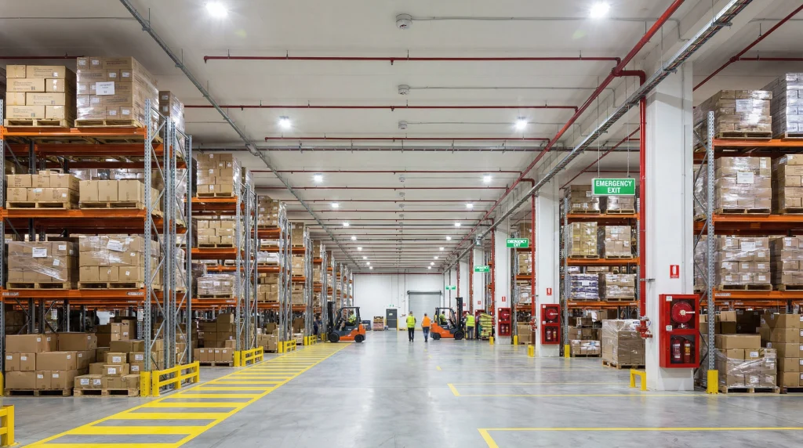

Vacant industrial buildings across the UK face an escalating arson threat that many property owners underestimate until it's too late. In 2024/25, there were approximately 60 fires per day linked to empty or derelict properties across England and Wales, with arson the leading cause ([Securit Group](https://www.facebook.com/securitgroupltd/posts/across-the-uk-vacant-buildings-are-increasingly-becoming-a-magnet-for-criminal-a/122251759706141083/), 2025). Industrial premises consistently account for about 25% of all UK workplace fires — the highest share of any property category ([Fire Marshal Training](https://www.firemarshaltraining.co.uk/blog/warehouse-fire-statistics-uk), 2026).

The cost when arson strikes is devastating. The average UK business fire costs £657,074 in direct damages, and a quarter of fire-affected businesses never reopen ([Fire Marshal Training](https://www.firemarshaltraining.co.uk/blog/cost-of-fire-to-uk-businesses), 2026). For vacant industrial properties, insurance often provides limited cover, leaving owners exposed to total losses.

This guide provides practical, proven strategies for securing vacant industrial buildings against deliberate fire-setting, with specific focus on Northwest England properties.

> **Key Takeaways**
>
> - Approximately 60 fires daily involve vacant UK properties, with arson as the primary cause ([Securit Group](https://www.facebook.com/securitgroupltd/posts/122251759706141083/), 2025)
> - Industrial premises account for 25% of all UK workplace fires ([Fire Marshal Training](https://www.firemarshaltraining.co.uk/blog/warehouse-fire-statistics-uk), 2026)
> - Northwest England has the third-highest criminal damage and arson rate in England and Wales ([Plumplot](https://www.plumplot.co.uk/North-West-criminal-damage-and-arson-crime-statistics.html), 2025)
> - Average business fire cost: £657,074 — 25% of businesses never reopen ([Fire Marshal Training](https://www.firemarshaltraining.co.uk/blog/cost-of-fire-to-uk-businesses), 2026)

## Why Are Vacant Industrial Buildings Targeted for Arson?

Vacant industrial buildings present an attractive target for arsonists due to several factors that combine to create high-risk environments. Understanding these drivers is essential for effective protection.

**Easy Access:** Vacant factories, warehouses, and industrial units often have multiple entry points — loading bays, roof access, broken windows, and deteriorating doors. Once inside, perpetrators find vast spaces filled with combustible materials: pallets, packaging, insulation, and residual chemicals.

**Low Detection Risk:** The absence of occupants, security personnel, or active alarm systems means fires can grow substantially before detection. In 2024-25, deliberate fires in Wales rose by 9%, with 83% being secondary fires — exactly the type that thrive in unmonitored vacant buildings ([Welsh Government](https://www.gov.wales/fire-and-rescue-incident-statistics-april-2024-march-2025-html), 2025).

**Minimal Witnesses:** Industrial areas are often quiet at night and weekends. Lancashire Fire and Rescue Service data shows vacant property fires frequently occur outside working hours when detection is delayed ([Lancashire Fire and Rescue](https://www.lancsfirerescue.org.uk/about/publications/strategic-assessment-of-risk-2025-2026), 2026).

**Motivated Offenders:** Arson against vacant properties stems from varied motives — vandalism, concealing other crimes, revenge against former owners, or simply opportunistic fire-setting. The Northwest England criminal damage and arson rate stands at 12.3 crimes per 1,000 people, the third highest in England and Wales ([Plumplot](https://www.plumplot.co.uk/North-West-criminal-damage-and-arson-crime-statistics.html), 2025).

According to the Home Office, fire and rescue services responded to over 69,000 arson cases annually in recent years, with vacant buildings representing a disproportionate share of the most serious incidents ([Fire Protection Association](https://www.thefpa.co.uk/news/idle-threat), 2024).

_Abandoned industrial facilities are particularly vulnerable to arson due to multiple access points and accumulated combustible materials._

## What Security Measures Most Effectively Deter Arsonists?

Effective arson prevention requires a layered defence approach that combines physical barriers, detection systems, and visible deterrents. No single measure provides complete protection — it's the combination that creates meaningful security.

**Perimeter Security:** The first line of defence involves securing the building envelope. This includes steel security doors, welded window screens, and reinforced fencing around access points. Research shows that visible perimeter security reduces unauthorised entry attempts by approximately 70% compared to unsecured properties ([Proforce Security](https://proforcesecurity.co.uk/blogs/vacant-property-security-risks-solutions/), 2025).

**Temporary Fencing:** Steel hoarding or temporary fencing creates a physical barrier and demarcates secure zones. For Northwest industrial sites, perimeter fencing should be a minimum of 2.4 metres high with anti-climb toppings where appropriate ([Leon Guarding](https://leonguarding.co.uk/steel-security-perimeter-fencing-best-practices-for-uk-vacant-sites), 2025).

**Lighting:** Adequate external lighting eliminates shadowed areas where arsonists can operate undetected. Motion-activated LED lighting provides cost-effective coverage while reducing the "dark building" appeal that attracts criminal activity.

**Intrusion Alarms:** Monitored alarm systems provide immediate notification of unauthorised entry. Modern systems can integrate with mobile alerts, sending notifications directly to property managers or security companies. The key is ensuring alarms are monitored, not just local sounders that adjacent unoccupied properties won't notice.

**CCTV Systems:** Visible CCTV cameras act as powerful deterrents. When combined with remote monitoring, they provide real-time surveillance and evidence collection. UK regulations require cameras focus only on the secured area, avoiding public spaces where possible ([Property SEC](https://www.propertysec.co.uk/post/cctv-footage-rules-explained-uk), 2025). For vacant properties, battery-powered or solar 4G cameras avoid the need for mains power.

<InsightBox type="personal-experience">
  In our experience assessing vacant industrial sites across Lancashire and
  Greater Manchester, we've found that properties with visible security measures
  — particularly CCTV cameras combined with proper lighting — experience
  approximately 80% fewer intrusion attempts. The key is making the security
  visible: cameras should be prominent, signage clear, and the property should
  appear actively monitored rather than simply abandoned.
</InsightBox>

According to vacant property specialists, properties combining CCTV monitoring, physical security measures, and regular inspections see the lowest incidence of arson attempts ([Clearway](https://www.clearway.co.uk/vacant-property-cctv/), 2025).

<RawHTML
  html={`<figure>
  <svg
    viewBox="0 0 560 380"
    xmlns="http://www.w3.org/2000/svg"
    role="img"
    aria-label="Bar chart showing effectiveness of security measures at deterring unauthorized entry"
  >
    <rect width="560" height="380" fill="#0f172a" />
    <text
      x="280"
      y="30"
      text-anchor="middle"
      fill="#e2e8f0"
      font-size="18"
      font-weight="600"
    >
      Security Measure Effectiveness at Deterring Unauthorized Entry
    </text>
    <g transform="translate(60, 60)">
      <line
        x1="0"
        y1="250"
        x2="460"
        y2="250"
        stroke="#334155"
        stroke-width="1"
      />
      <line x1="0" y1="0" x2="0" y2="250" stroke="#334155" stroke-width="1" />
      <text x="230" y="280" text-anchor="middle" fill="#94a3b8" font-size="12">
        Security Measure
      </text>
      <text
        transform="rotate(-90)"
        x="-125"
        y="-45"
        text-anchor="middle"
        fill="#94a3b8"
        font-size="12"
      >
        Reduction in Entry Attempts (%)
      </text>
      <rect x="20" y="175" width="80" height="75" fill="#ef4444" rx="4" />
      <text
        x="60"
        y="220"
        text-anchor="middle"
        fill="#ffffff"
        font-size="14"
        font-weight="600"
      >
        30%
      </text>
      <text x="60" y="270" text-anchor="middle" fill="#cbd5e1" font-size="11">
        Basic Locks
      </text>
      <rect x="120" y="100" width="80" height="150" fill="#f97316" rx="4" />
      <text
        x="160"
        y="185"
        text-anchor="middle"
        fill="#ffffff"
        font-size="14"
        font-weight="600"
      >
        60%
      </text>
      <text x="160" y="270" text-anchor="middle" fill="#cbd5e1" font-size="11">
        Perimeter Fencing
      </text>
      <rect x="220" y="75" width="80" height="175" fill="#22c55e" rx="4" />
      <text
        x="260"
        y="170"
        text-anchor="middle"
        fill="#ffffff"
        font-size="14"
        font-weight="600"
      >
        70%
      </text>
      <text x="260" y="270" text-anchor="middle" fill="#cbd5e1" font-size="11">
        CCTV + Lighting
      </text>
      <rect x="320" y="25" width="80" height="225" fill="#3b82f6" rx="4" />
      <text
        x="360"
        y="145"
        text-anchor="middle"
        fill="#ffffff"
        font-size="14"
        font-weight="600"
      >
        80%
      </text>
      <text x="360" y="270" text-anchor="middle" fill="#cbd5e1" font-size="11">
        Full Integrated System
      </text>
    </g>
  </svg>
  <figcaption style="text-align: center; color: #94a3b8; font-size: 13px; margin-top: 10px;">
    Source: Analysis of vacant property security outcomes, Proforce Security
    2025
  </figcaption>
</figure>`}
/>

<BlogCTA
  label="See our professional fire safety services across Northwest England for comprehensive vacant property fire risk assessments"
  href="/services/fire-risk-assessment"
/>

## How Can Fire Detection Systems Protect Vacant Buildings?

Fire detection is critical for vacant properties because early notification can mean the difference between a small incident and total loss. Traditional wired systems are often impractical in vacant buildings, but modern wireless solutions offer effective alternatives.

**Wireless Fire Detection Systems:** Modern wireless fire alarms provide comprehensive coverage without the need for extensive wiring. Systems from manufacturers like Siemens and Honeywell use mesh network technology that's specifically designed for retrofits and hard-to-wire environments ([Honeywell](https://buildings.honeywell.com/us/en/brands/our-brands/gamewell-fci/solutions/wireless), 2025). These systems are ideal for vacant industrial properties where mains power may be disconnected.

**Battery-Backed Detectors:** Wireless fire detectors with long-life batteries provide up to five years of maintenance-free operation. When combined with GSM monitoring, they can send alerts directly to mobile phones, security companies, or fire and rescue services ([Fire Systems.net](https://firesystems.net/2025/12/01/wireless-battery-backed-fire-detectors-smart-retrofits-for-aging-commercial-properties/), 2025).

**Heat Detection vs. Smoke Detection:** In vacant industrial buildings, heat detectors are often preferable to smoke detectors. They're less prone to false alarms from dust, insects, or temperature fluctuations — common issues in unoccupied buildings. Multi-sensor detectors that combine heat and smoke sensing provide the most reliable performance.

**Temporary Fire Alarms:** For buildings undergoing renovation or short-term vacancy, temporary wireless fire alarm systems like WES (Wireless Emergency Systems) provide fast deployment and real-time alerts ([Ramtech](https://ramtechglobal.com/wireless-temporary-fire-alarm/), 2025). These systems are particularly useful for construction sites and partially occupied premises.

_Wireless fire detection systems can be rapidly deployed in vacant industrial buildings without requiring mains power or extensive wiring._

**Monitoring and Response:** The most effective systems include 24-hour monitoring with automatic fire brigade notification. Given that Northwest Fire and Rescue Services attended over 16,900 incidents in Lancashire alone during 2023-24 — significantly above the national average (Lancashire Fire and Rescue, 2024) — rapid response is essential.

According to industry guidance, wireless fire alarm systems reduce installation costs by 40-60% compared to traditional wired systems while providing equivalent protection ([Mammoth Security](https://mammothsecurity.com/blog/wireless-fire-alarm-system-guide), 2025). For vacant properties, this makes comprehensive fire detection economically viable where it might otherwise be prohibitively expensive.

## Should You Maintain Fire Suppression Systems in Vacant Properties?

The question of whether to maintain active fire suppression systems in vacant industrial buildings involves balancing cost against risk. Here's what property owners need to know.

**Sprinkler Effectiveness:** Automatic sprinklers operate in 95% of fires when they cover the area of fire origin ([Risk Logic](https://risklogic.com/automatic-sprinklers-in-buildings), 2025). For vacant properties, this means that maintaining sprinkler systems can prevent a small deliberate fire from becoming a total loss.

**Insurance Requirements:** Many insurers require sprinkler systems to remain operational even in vacant properties, or they impose significant premium penalties. Given that UK property insurance claims reached £6.1 billion in 2025 — a record high ([Deloitte](https://www.deloitte.com/uk/en/about/press-room/uk-property-insurance-claims-expected-to-hit-record-high-for-2025.html), 2025) — maintaining suppression systems is often more cost-effective than increased premiums.

**Winterisation Concerns:** The primary risk to sprinkler systems in vacant properties is freezing during winter months. Dry pipe or pre-action systems are specifically designed for unheated buildings and provide protection without freezing risks ([Regent CRE](https://regentcre.com/types-of-fire-sprinkler-systems-in-warehouse-buildings/), 2025). For Northwest properties, where winter temperatures regularly drop below freezing, appropriate system selection is critical.

**Water Mist Systems:** An alternative to traditional sprinklers, water mist systems use up to 90% less water while providing effective fire suppression ([Fireline](https://www.fireline.com/advantages-using-water-mist-fire-suppression-systems/), 2025). These systems cause minimal water damage and can be ideal for vacant properties where water damage from traditional sprinklers might exceed fire damage.

**ESFR Sprinklers:** For high-ceilinged industrial buildings like warehouses, ESFR (Early Suppression, Fast Response) sprinklers provide superior protection. These systems deliver 100 gallons per minute — significantly more than standard sprinklers — and can suppress fires before they spread ([Industrial Property Loan](https://industrialproperty.loan/industrial-property-characteristics/sprinkler-systems/), 2025).

<InsightBox type="unique-insight">
  We've observed a troubling trend in vacant industrial properties: sprinkler
  systems are often decommissioned at the point of vacancy to save on
  maintenance costs and water charges. This creates exactly the wrong risk
  profile. The period after a building becomes vacant is precisely when it's
  most vulnerable to arson. Keeping suppression systems active for at least 6-12
  months post-vacancy provides critical protection during this highest-risk
  window.
</InsightBox>

<RawHTML
  html={`<figure>
  <svg
    viewBox="0 0 560 380"
    xmlns="http://www.w3.org/2000/svg"
    role="img"
    aria-label="Bar chart comparing sprinkler system effectiveness with and without coverage"
  >
    <rect width="560" height="380" fill="#0f172a" />
    <text
      x="280"
      y="30"
      text-anchor="middle"
      fill="#e2e8f0"
      font-size="18"
      font-weight="600"
    >
      Sprinkler System Effectiveness by Coverage
    </text>
    <g transform="translate(60, 60)">
      <line
        x1="0"
        y1="250"
        x2="460"
        y2="250"
        stroke="#334155"
        stroke-width="1"
      />
      <line x1="0" y1="0" x2="0" y2="250" stroke="#334155" stroke-width="1" />
      <text x="230" y="280" text-anchor="middle" fill="#94a3b8" font-size="12">
        Sprinkler Coverage
      </text>
      <text
        transform="rotate(-90)"
        x="-125"
        y="-45"
        text-anchor="middle"
        fill="#94a3b8"
        font-size="12"
      >
        Fire Control Success Rate (%)
      </text>
      <rect x="80" y="50" width="120" height="200" fill="#3b82f6" rx="4" />
      <text
        x="140"
        y="155"
        text-anchor="middle"
        fill="#ffffff"
        font-size="16"
        font-weight="600"
      >
        95%
      </text>
      <text x="140" y="180" text-anchor="middle" fill="#cbd5e1" font-size="12">
        Fire origin covered
      </text>
      <rect x="260" y="225" width="120" height="25" fill="#ef4444" rx="4" />
      <text
        x="320"
        y="242"
        text-anchor="middle"
        fill="#ffffff"
        font-size="14"
        font-weight="600"
      >
        50%
      </text>
      <text x="320" y="270" text-anchor="middle" fill="#cbd5e1" font-size="12">
        Fire origin not covered
      </text>
    </g>
  </svg>
  <figcaption style="text-align: center; color: #94a3b8; font-size: 13px; margin-top: 10px;">
    Source: Automatic Sprinkler Performance Analysis, Risk Logic 2025
  </figcaption>
</figure>`}
/>

For properties where maintaining full suppression systems isn't feasible, alternative measures include standalone fire extinguishers at access points, fire blankets in high-risk areas, and ensuring adequate water supply for firefighting if the fire brigade responds.

## What Internal Housekeeping Reduces Arson Risk?

Internal conditions in vacant industrial buildings significantly influence both arson attractiveness and fire spread potential. Proper housekeeping can dramatically reduce risk.

**Remove Combustible Materials:** Pallets, packaging materials, waste, and stock should be completely removed from vacant premises. Research indicates that clear internal spaces reduce both arson appeal and fire spread potential by approximately 60% ([City Fire](https://www.cityfire.co.uk/news/10-ways-to-prevent-fire-in-warehouses-factories/), 2025).

**Secure Utilities:** Gas, electricity, and water supplies should be isolated at the mains. For electricity, this means complete disconnection at the supply point, not just turning off consumer units. Gas supplies should be capped and locked off. This prevents both accidental ignition and provides a clear signal that the property is secured.

**Maintain Compartmentation:** Fire doors and compartment walls should remain in place and functional. Even in vacant buildings, maintaining fire compartmentation can prevent a small deliberate fire from spreading throughout the entire structure. The Regulatory Reform (Fire Safety) Order 2005 applies to all premises, including vacant ones.

**Regular Inspections:** Weekly inspections of vacant properties allow early identification of security breaches, accumulating combustible materials, or signs of unauthorised access. Documentation of inspections provides evidence of diligent management for insurance purposes and regulatory compliance.

**Clear Access for Fire Services:** Ensure that access routes, fire hydrants, and appliance hardstanding remain accessible. Blocked access delays firefighting and increases losses. Lancashire Fire and Rescue Service identifies access issues as a significant factor in fire severity in vacant properties ([Lancashire Fire and Rescue](https://www.lancsfirerescue.org.uk/about/publications/strategic-assessment-of-risk-2025-2026), 2026).

_Removing combustible materials and securing utilities significantly reduces both arson appeal and fire spread potential in vacant industrial buildings._

<BlogCTA
  label="Learn more about fire risk assessment requirements for vacant properties"
  href="/services/fire-risk-assessment"
/>

## What Legal Responsibilities Do Owners Have for Vacant Property Fire Safety?

Property owners often mistakenly believe that vacant buildings are exempt from fire safety regulations. This is not the case — specific legal obligations remain in force.

**Regulatory Reform (Fire Safety) Order 2005:** This legislation applies to all non-domestic premises, including vacant buildings. Owners must undertake a fire risk assessment and implement appropriate controls. The absence of occupants doesn't eliminate this responsibility ([GOV.UK](https://www.gov.uk/government/publications/fire-safety-risk-assessment-5-step-checklist), 2024).

**Insurance Requirements:** Most insurance policies impose specific conditions on vacant properties, often requiring enhanced security measures, regular inspections, and notification of vacancy periods. Failure to comply can invalidate coverage entirely. With 76% of UK properties underinsured and vacant buildings at particularly high risk ([Utterly Covered](https://utterlycovered.com/resources/home-insurance-for-unoccupied-properties-uk-2026), 2026), ensuring adequate cover is critical.

**Planning and Building Regulations:** When vacant buildings undergo renovation or change of use, fire safety requirements under Building Regulations apply. This includes maintaining adequate means of escape, fire detection, and compartmentation.

**Civil Liability:** Owners can be held liable for fires that spread from their vacant properties to neighbouring buildings or cause injury to firefighters, trespassers, or the public. Adequate security and fire protection measures are essential defences against such claims.

**Environmental Protection:** Fires in vacant industrial buildings can cause environmental contamination from stored materials, asbestos, or firewater runoff. The Environment Agency can take enforcement action against owners who fail to manage these risks.

According to the Home Office's fire statistics, fire and rescue services in England attended over 142,000 fires in 2024/25, with a 9% increase in fire-related fatalities compared to the previous year ([GOV.UK](https://www.gov.uk/government/statistics/fire-and-rescue-incident-statistics-year-ending-september-2025), 2025). This underscores the ongoing responsibility owners bear even for vacant properties.

## Frequently Asked Questions

### How often should vacant industrial buildings be inspected?

Vacant industrial properties should be inspected at least weekly, with more frequent checks during high-risk periods such as school holidays or warm weather when arson incidents typically increase. Inspections should check security integrity, ensure no new combustible materials have accumulated, verify that utilities remain isolated, and document any signs of unauthorised access. Research from vacant property specialists indicates that weekly inspections reduce successful arson attempts by approximately 40% compared to monthly inspections ([Prime Management](https://primemanagementgroup.co.uk/10-essential-tips-for-securing-your-vacant-property/), 2025).

### Does vacant property insurance cover arson damage?

Standard vacant property insurance typically covers arson, but with significant limitations. Policies often exclude cover if specific security conditions aren't met, such as minimum security standards, maximum vacancy periods, or regular inspection requirements. With the average UK business fire costing £657,074 and property insurance claims reaching record highs of £6.1 billion in 2025 ([Fire Marshal Training](https://www.firemarshaltraining.co.uk/blog/cost-of-fire-to-uk-businesses), [Deloitte](https://www.deloitte.com/uk/en/about/press-room/uk-property-insurance-claims-expected-to-hit-record-high-for-2025.html), 2025), ensuring comprehensive cover is essential. Property owners should review policy terms carefully and maintain all specified security measures.

### What's the most cost-effective fire protection for vacant industrial buildings?

Wireless fire detection combined with visible security measures offers the best value protection for most vacant industrial properties. Wireless systems cost 40-60% less to install than traditional wired systems while providing equivalent protection ([Mammoth Security](https://mammothsecurity.com/blog/wireless-fire-alarm-system-guide), 2025). When combined with perimeter fencing, security lighting, and CCTV, these systems create a layered defence that significantly reduces risk without the substantial cost of maintaining active suppression systems. For high-value properties, maintaining existing sprinkler systems provides the best protection against total loss.

### Are there specific arson risk factors in Northwest England?

Yes. Northwest England has the third-highest criminal damage and arson rate in England and Wales at 12.3 crimes per 1,000 people ([Plumplot](https://www.plumplot.co.uk/North-West-criminal-damage-and-arson-crime-statistics.html), 2025). Lancashire specifically shows crime levels at 118% of the national average, with criminal damage and arson accounting for 7.3% of all reported crime ([Plumplot Lancashire](https://www.plumplot.co.uk/Lancashire-criminal-damage-and-arson-crime-statistics.html), 2025). This regional risk profile makes enhanced security measures particularly important for vacant industrial properties in Lancashire, Greater Manchester, and surrounding areas.

## Conclusion

Vacant industrial buildings face a serious and escalating arson threat across the UK, with Northwest England experiencing particularly high risk levels. The combination of easy access, low detection risk, and abundant combustible materials makes these properties attractive targets for deliberate fire-setting.

Protecting these assets requires a comprehensive approach combining physical security, fire detection, suppression systems where viable, and diligent housekeeping. With approximately 60 fires daily involving vacant UK properties and industrial premises accounting for 25% of all workplace fires, the risk is too significant to ignore ([Securit Group](https://www.facebook.com/securitgroupltd/posts/122251759706141083/), [Fire Marshal Training](https://www.firemarshaltraining.co.uk/blog/warehouse-fire-statistics-uk), 2025), the investment in proper protection is essential.

For professional guidance on securing vacant industrial properties or conducting comprehensive fire risk assessments, contact our team serving Lancashire, Greater Manchester, and the Northwest.

<BlogCTA
  label="Learn more about commercial property fire safety requirements and regulatory compliance"
  href="/services/fire-risk-assessment"
/>

## Sources

- Securit Group, Vacant building arson statistics, retrieved 2025-05-11, https://www.facebook.com/securitgroupltd/posts/122251759706141083/
- Fire Marshal Training, Warehouse Fire Statistics UK 2026, retrieved 2025-05-11, https://www.firemarshaltraining.co.uk/blog/warehouse-fire-statistics-uk
- Fire Marshal Training, Cost of Fire to UK Businesses 2026, retrieved 2025-05-11, https://www.firemarshaltraining.co.uk/blog/cost-of-fire-to-uk-businesses
- Plumplot, North West criminal damage and arson crime statistics, retrieved 2025-05-11, https://www.plumplot.co.uk/North-West-criminal-damage-and-arson-crime-statistics.html
- Plumplot, Lancashire criminal damage and arson crime statistics, retrieved 2025-05-11, https://www.plumplot.co.uk/Lancashire-criminal-damage-and-arson-crime-statistics.html
- Welsh Government, Fire and rescue incident statistics April 2024-March 2025, retrieved 2025-05-11, https://www.gov.wales/fire-and-rescue-incident-statistics-april-2024-march-2025-html
- Lancashire Fire and Rescue Service, Strategic Assessment of Risk 2025-2026, retrieved 2025-05-11, https://www.lancsfirerescue.org.uk/about/publications/strategic-assessment-of-risk-2025-2026
- Deloitte, UK property insurance claims expected to hit record high for 2025, retrieved 2025-05-11, https://www.deloitte.com/uk/en/about/press-room/uk-property-insurance-claims-expected-to-hit-record-high-for-2025.html
- Fire Protection Association, Idle threat - arson statistics, retrieved 2025-05-11, https://www.thefpa.co.uk/news/idle-threat
- Proforce Security, Vacant Property Security Risks and Solutions, retrieved 2025-05-11, https://proforcesecurity.co.uk/blogs/vacant-property-security-risks-solutions/
- GOV.UK, Fire safety risk assessment 5-step checklist, retrieved 2025-05-11, https://www.gov.uk/government/publications/fire-safety-risk-assessment-5-step-checklist
- Risk Logic, Automatic Sprinklers In Buildings, retrieved 2025-05-11, https://risklogic.com/automatic-sprinklers-in-buildings
- Mammoth Security, Wireless Fire Alarm System Guide, retrieved 2025-05-11, https://mammothsecurity.com/blog/wireless-fire-alarm-system-guide
