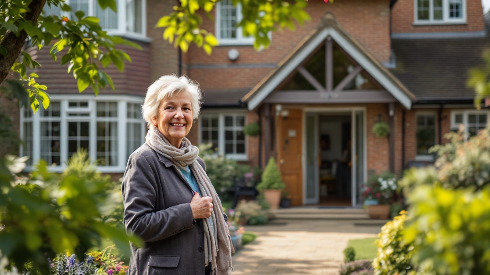
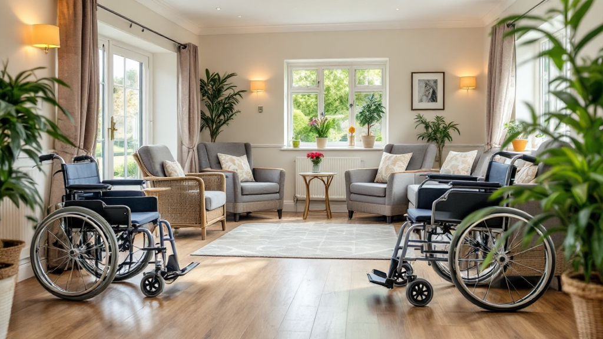
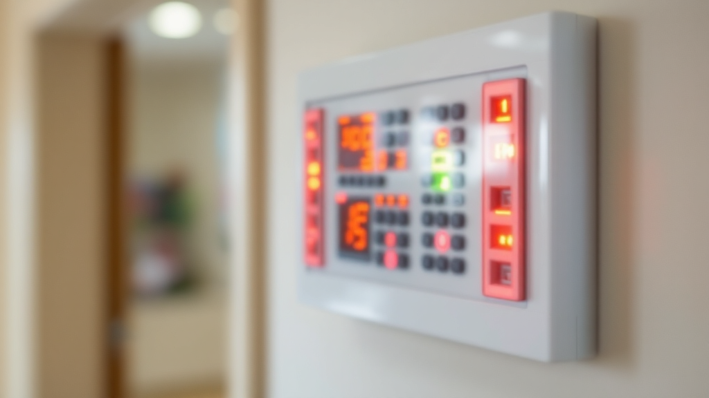

Care homes and residential care facilities require specialist fire risk assessments that account for vulnerable residents, progressive horizontal evacuation, medical oxygen safety, and CQC compliance requirements. Under the Regulatory Reform (Fire Safety) Order 2005 and CQC fundamental standards, care home operators must demonstrate that evacuation plans are tailored to each resident's level of dependency.

### Serving Care Homes Across the UK

We work with care home managers, registered managers, and compliance officers responsible for all types of care facilities:

- **Residential care homes** — elderly and vulnerable adult care
- **Nursing homes** — with medical gas and complex care needs
- **Dementia specialist units** — enhanced evacuation requirements
- **Learning disability homes** — tailored PEEP development
- **Multi-home operators** — coordinated compliance across locations

### Complete CQC-Compliant Assessment Package

Every care home fire risk assessment includes a comprehensive package designed to meet all current legislative requirements and CQC inspection standards:

- **Full home inspection** — resident areas, communal spaces, kitchens, plant rooms
- **Individual PEEP development** — for each resident category and dependency level
- **Fire compartmentation verification** — 10-bed maximum per compartment compliance
- **Medical oxygen safety assessment** — storage, ventilation, and separation verification
- **Horizontal evacuation planning** — progressive routes and refuge area capacity
- **Night staffing evaluation** — adequacy against resident PEEPs and dependency categories
- **Fire door inspection** — FD30/FD60 ratings, self-closers, quarterly compliance
- **Detailed photographic report** — CQC-approved with risk ratings and prioritised action plan
- **Ongoing compliance support** — guidance on implementing recommendations and review scheduling

### Why Care Home Managers Choose Fire Assessment North

Care home managers across the UK trust us for their facilities because we understand the specific challenges of vulnerable resident fire safety:

- **24-hour turnaround** on standard assessments — CQC inspection ready
- **BAFE SP205 registered** — independently audited and accredited
- **CQC-compliant documentation** — accepted by inspectors without question
- **PEEP specialists** — individual plans for every resident category
- **Medical oxygen expertise** — storage, handling, and evacuation safety
- **Portfolio discounts** — reduced rates for multi-home operators

