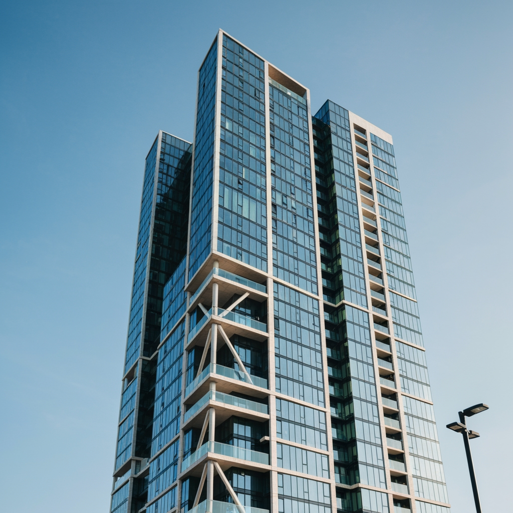
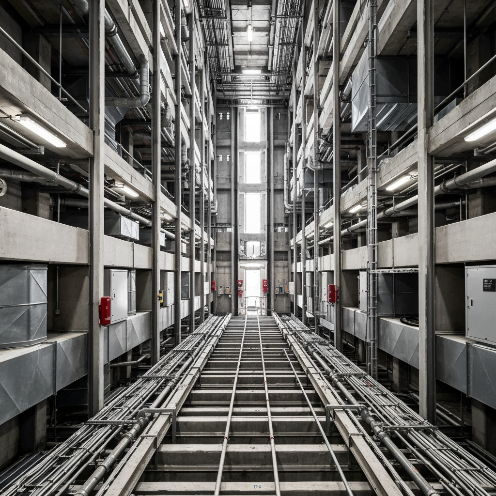

High-rise buildings over 18 metres present unique fire safety challenges that require specialist assessment. Following the Grenfell Tower fire and subsequent regulatory changes, high-rise buildings face heightened scrutiny around external wall systems, evacuation strategies, and firefighting access. The Building Safety Act 2022 introduced new requirements including building registration, Accountable Person duties, and enhanced compliance obligations.

### Serving High-Rise Buildings Across the UK

We work with building owners, freeholders, managing agents, and Accountable Persons responsible for all types of high-rise buildings:

- **Residential towers** — purpose-built blocks of flats
- **Mixed-use high-rise** — commercial units below residential
- **Student accommodation towers** — purpose-built high-rise student living
- **Converted high-rise** — older buildings with post-Grenfell compliance needs
- **Portfolio management** — multiple high-rise buildings under management

### Complete Building Safety Act 2022 Compliance Package

Every high-rise fire risk assessment includes a comprehensive package designed to meet all current legislative requirements and Building Safety Regulator standards:

- **Full building inspection** — external walls, risers, lift shafts, stairwells, communal areas
- **External wall assessment** — cladding materials, ACM identification, cavity barriers, EWS1 support
- **Compartmentation survey** — fire barriers, floor penetrations, fire-stopping, fire doors
- **Evacuation strategy evaluation** — stay-put viability assessment, simultaneous evacuation planning
- **Firefighting access review** — firefighting lift compliance, pressurised stairwells, smoke control
- **Accountable Person duties review** — registration status, safety case documentation, resident engagement
- **Detailed photographic report** — Building Safety Regulator ready with risk ratings and prioritised action plan
- **Ongoing compliance support** — guidance on implementing recommendations and remediation scheduling

### Why Building Owners Choose Fire Assessment North

Building owners and Accountable Persons across the UK trust us for their high-rise buildings because we understand the specific challenges of post-Grenfell fire safety:

- **24-hour turnaround** on standard assessments — Building Safety Regulator ready
- **BAFE SP205 registered** — independently audited and accredited
- **Post-Grenfell specialists** — Building Safety Act 2022, EWS1, external wall expertise
- **Accountable Person guidance** — clear, actionable compliance support
- **Evacuation strategy expertise** — stay-put vs simultaneous evacuation assessment
- **Competitive pricing** — transparent fees from £750

