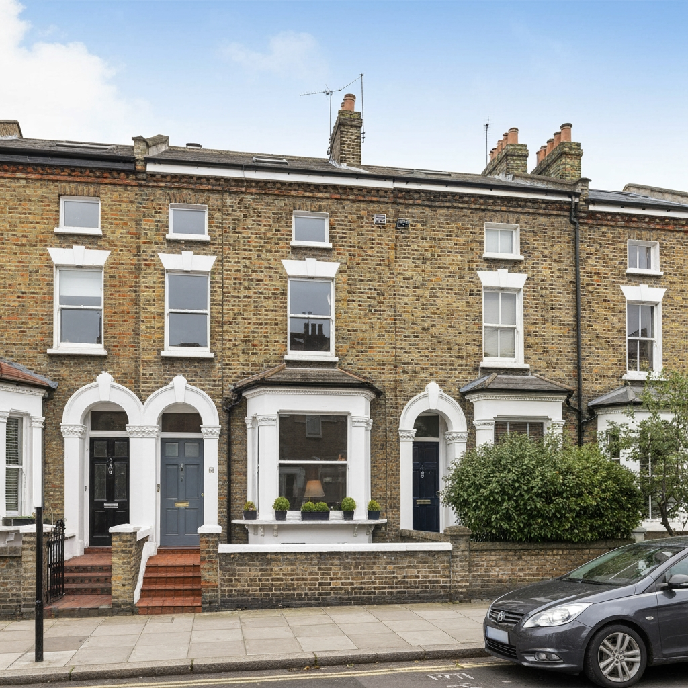
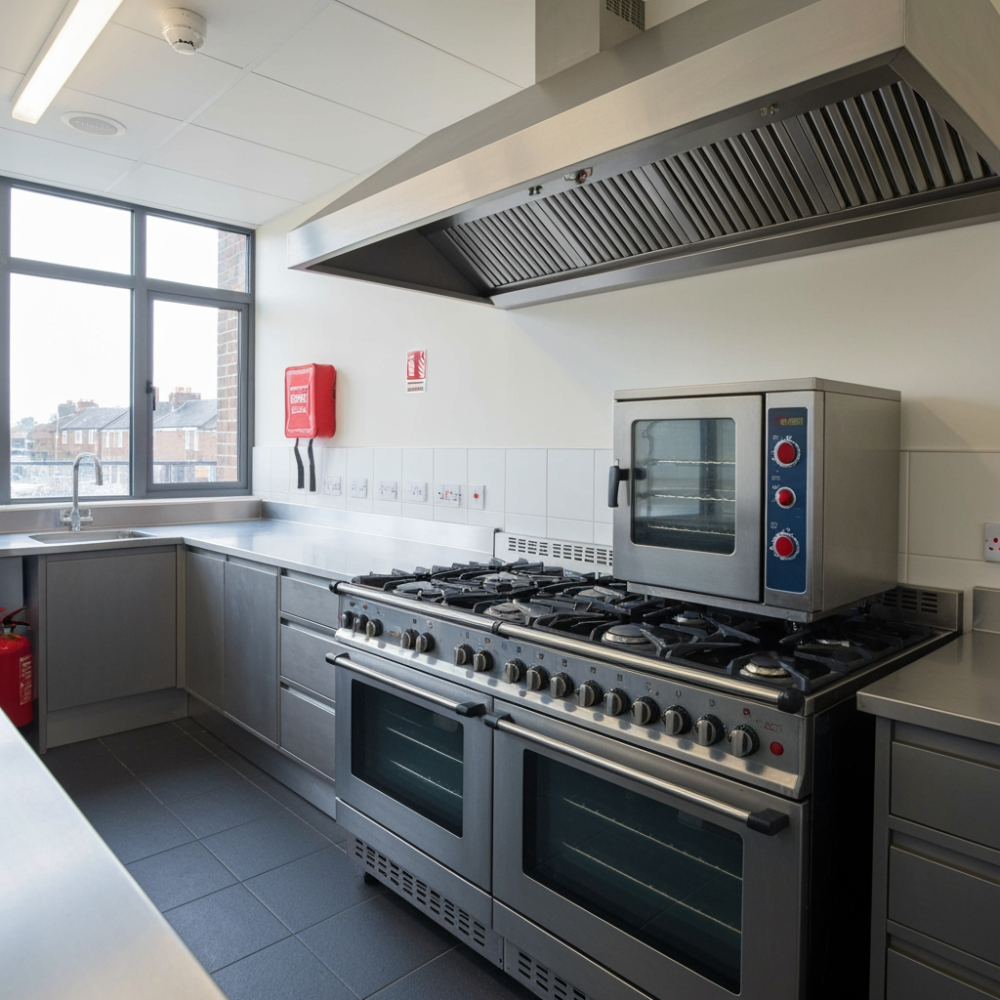
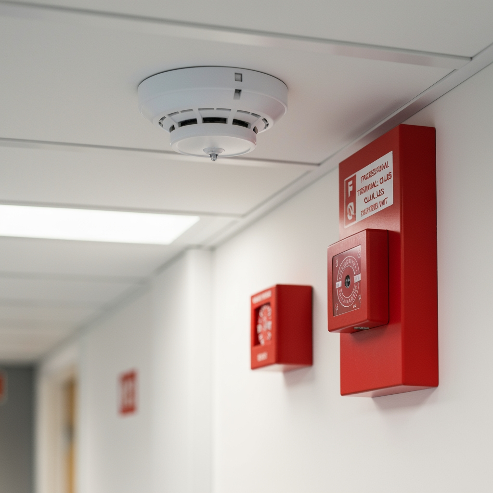

Houses in Multiple Occupation (HMOs) carry a heightened fire risk due to the number of unrelated occupants sharing facilities and escape routes. Under the Regulatory Reform (Fire Safety) Order 2005 and Housing Act 2004, landlords and managing agents have a legal duty to ensure adequate fire safety measures are in place, and local authorities often impose additional licensing conditions requiring up-to-date fire risk assessments.

## Serving HMO Landlords Across the UK

We work with HMO landlords, managing agents, and property investors responsible for all types of multi-occupied properties:

- **Converted houses** — period properties converted into bedsits or flats
- **Purpose-built HMOs** — modern buildings designed for multiple occupancy
- **Student houses** — shared student accommodation
- **Licensed HMOs** — properties requiring mandatory HMO licensing (5+ occupants)
- **Portfolio landlords** — multiple HMO properties under management

## Complete HMO Fire Safety Assessment Package

Every HMO fire risk assessment includes a comprehensive package designed to meet all current legislative requirements and licensing standards:

- **Full property inspection** — communal areas, escape routes, fire doors, and safety equipment
- **Kitchen fire safety assessment** — shared kitchen layout, appliance safety, heat detection
- **Fire door survey** — FD30/FD60 ratings, self-closers, seals, gap measurements
- **Fire detection system audit** — BS 5839-6 Grade and Category compliance verification
- **Escape route evaluation** — travel distances, corridor widths, stairwell clearances
- **Electrical safety review** — consumer unit capacity, circuit protection, EICR verification
- **Detailed photographic report** — insurance-approved with risk ratings and prioritised action plan
- **Ongoing compliance support** — guidance on implementing recommendations and review scheduling

## Why HMO Landlords Choose Fire Assessment North

HMO landlords and managing agents across the UK trust us for their properties because we understand the specific challenges of multi-occupied housing fire safety:

- **24-hour turnaround** on standard assessments — licensing deadlines met every time
- **BAFE SP205 registered** — independently audited and accredited
- **HMO licensing specialists** — documentation accepted by all local authorities
- **Portfolio discounts** — reduced rates for landlords with 5+ properties
- **Fixed transparent pricing** — from £250, no hidden costs
- **Tenant safety guides** — customised fire safety information for residents

