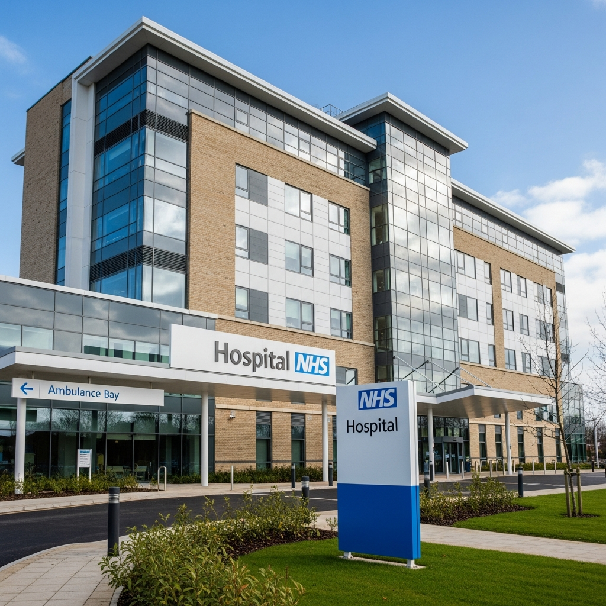
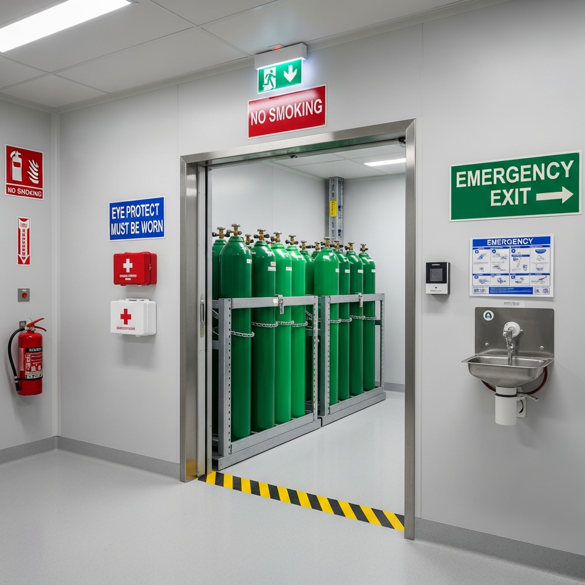
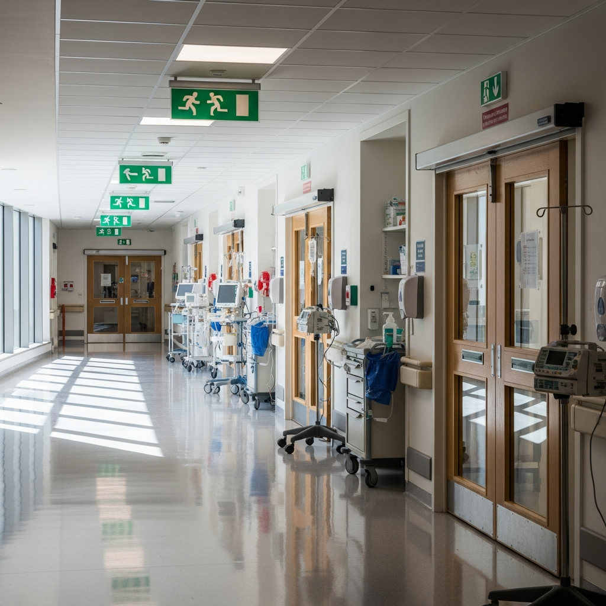

Hospitals and healthcare premises require the most complex fire safety strategies of any building type due to the presence of patients who cannot self-evacuate. Healthcare fire risk assessments must follow HTM 05-01 guidance alongside the Regulatory Reform (Fire Safety) Order 2005, and must account for medical gas installations, progressive horizontal evacuation, and CQC fundamental standards.

## Serving Hospitals & Healthcare Facilities Across the UK

We work with NHS trust managers, hospital compliance officers, and private healthcare providers responsible for all types of healthcare premises:

- **NHS trusts** — acute hospitals, community hospitals, and specialist facilities
- **Private hospitals** — independent healthcare facilities
- **Mental health units** — secure and open facility assessment
- **Day surgery centres** — ambulatory care and outpatient facilities
- **Community health centres** — primary care and clinic facilities

## Complete HTM-Compliant Assessment Package

Every hospital fire risk assessment includes a comprehensive package designed to meet all current legislative requirements and CQC inspection standards:

- **Full clinical area survey** — patient areas, ICU, operating theatres, A&E, and mental health units
- **Medical gas system assessment** — oxygen storage, pipeline systems, manifold rooms
- **Progressive horizontal evacuation** — compartmentation, refuge areas, patient categorisation
- **Operating theatre assessment** — oxygen management, electrosurgical safety, ventilation
- **Pharmaceutical storage review** — COSHH/DSEAR compliance, flammable liquid storage
- **Mental health unit evaluation** — arson prevention, secure evacuation, ligature-resistant equipment
- **Electrical system assessment** — medical equipment loads, backup power, UPS systems
- **Detailed photographic report** — CQC-compliant with risk ratings and prioritised action plan
- **Ongoing compliance support** — guidance on implementing recommendations and review scheduling

## Why NHS Trusts Choose Fire Assessment North

NHS trust managers and hospital compliance officers across the UK trust us for their facilities because we understand the specific challenges of healthcare fire safety:

- **5-day report delivery** — comprehensive HTM-compliant reports for CQC inspections
- **BAFE SP205 registered** — independently audited and accredited
- **HTM 05-02/03 specialists** — healthcare-specific expertise, not generic checklists
- **CQC-accepted documentation** — reports recognised by inspectors without question
- **Clinical understanding** — pragmatic solutions that support patient care delivery
- **Competitive pricing** — from £2,995 for comprehensive trust assessments

