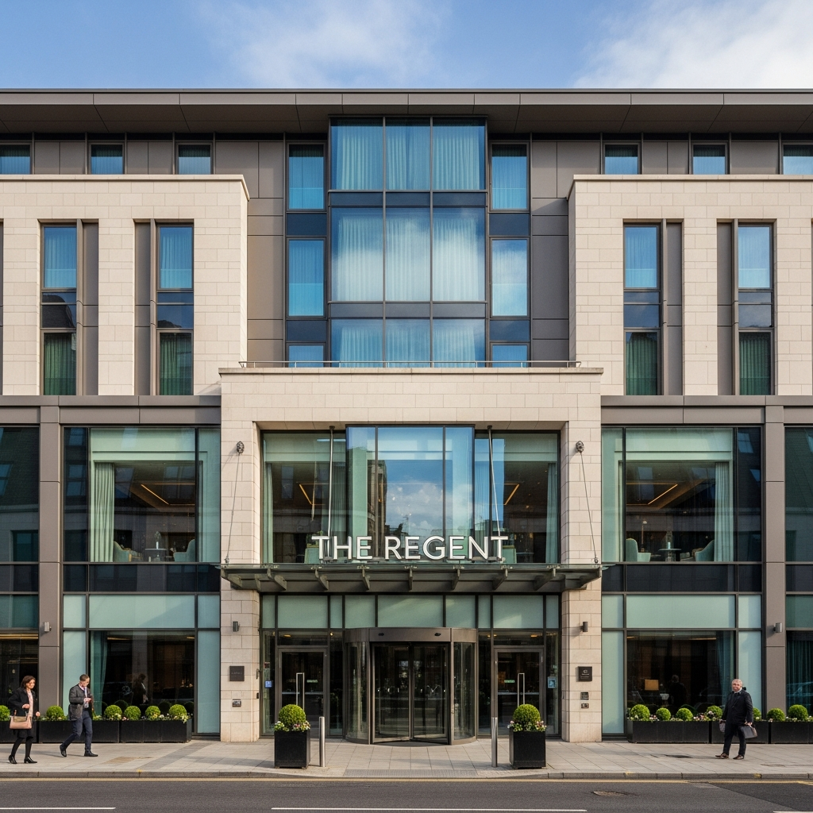
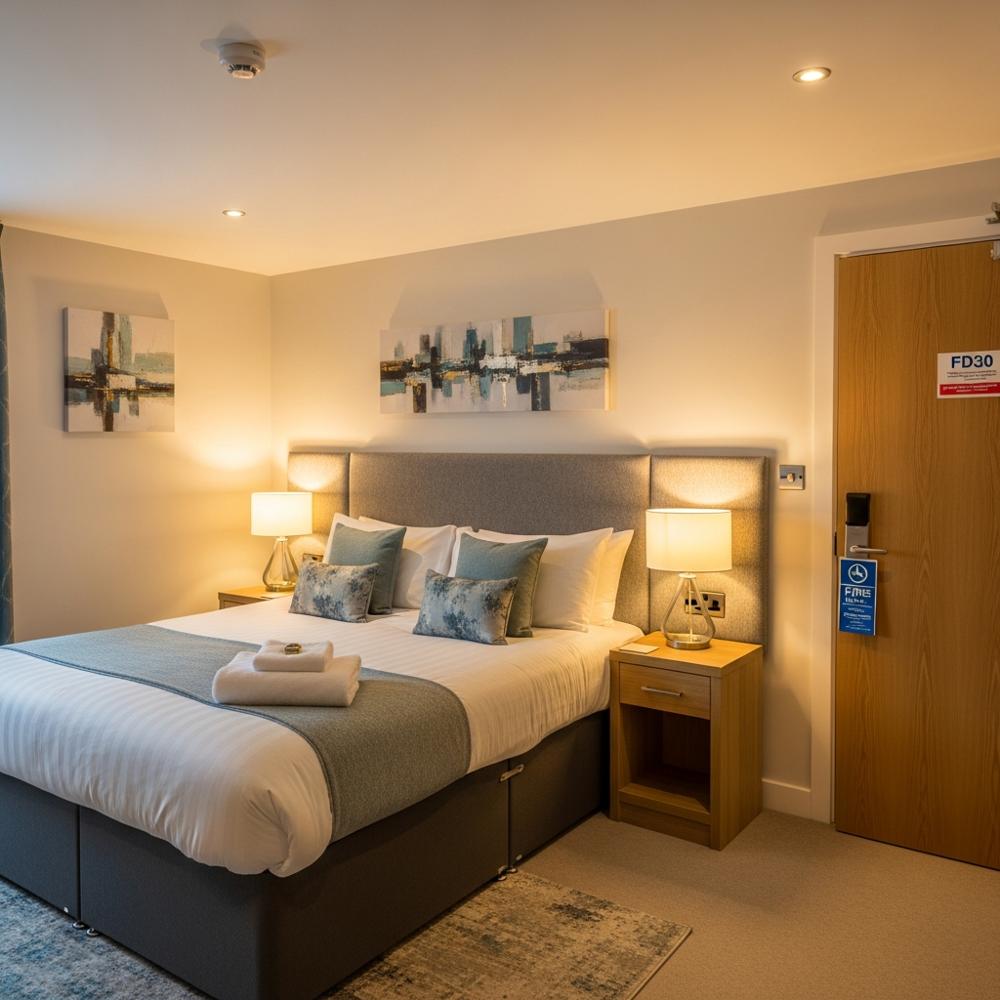
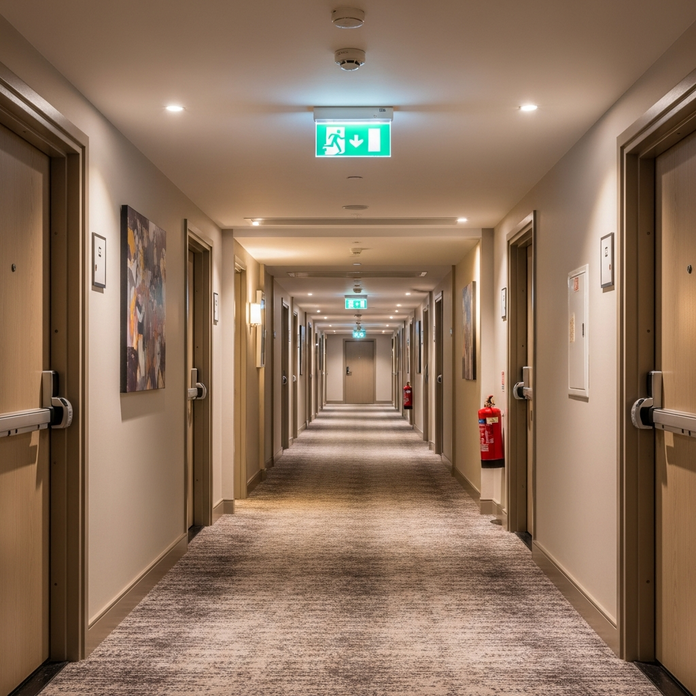

Hotels, guest houses, and bed and breakfasts require specialist fire risk assessments that address sleeping guest safety, 24/7 operations, commercial kitchen hazards, and multi-language evacuation procedures. Under the Regulatory Reform (Fire Safety) Order 2005, hotel operators have specific duties to ensure fire detection, escape routes, and evacuation procedures protect sleeping occupants at all hours.

### Serving Hotels & Hospitality Across the UK

We work with hotel operators, general managers, and compliance officers responsible for all types of hospitality premises:

- **Hotels** — budget, boutique, and luxury establishments
- **Guest houses & B&Bs** — smaller hospitality premises
- **Conference hotels** — with event and meeting facilities
- **Spa & leisure hotels** — with swimming pools and treatment areas
- **Multi-site hotel groups** — coordinated compliance across locations

### Complete Hotel Fire Safety Assessment Package

Every hotel fire risk assessment includes a comprehensive package designed to meet all current legislative requirements and licensing standards:

- **Full hotel inspection** — guest rooms, corridors, kitchens, conference facilities, back-of-house
- **Sleeping guest safety evaluation** — FD30 fire doors, alarm audibility, smoke detection
- **Commercial kitchen assessment** — suppression systems, extraction, grease accumulation
- **Conference facility evaluation** — occupancy calculations, partition fire resistance, emergency lighting
- **Disabled guest PEEPs** — refuge areas, evacuation chairs, visual and audible alarms
- **Multi-language procedure review** — fire action notices, welcome packs, voice alarm systems
- **Night staffing assessment** — adequacy evaluation for sleeping guest protection
- **Detailed photographic report** — licensing-compliant with risk ratings and prioritised action plan
- **Ongoing compliance support** — guidance on implementing recommendations and review scheduling

### Why Hotel Operators Choose Fire Assessment North

Hotel operators across the UK trust us for their premises because we understand the specific challenges of hospitality fire safety:

- **24-hour turnaround** on standard assessments — licensing deadlines met every time
- **BAFE SP205 registered** — independently audited and accredited
- **Sleeping guest specialists** — alarm audibility, FD30 doors, evacuation procedures
- **Multi-language expertise** — international guest communication strategies
- **Commercial kitchen assessment** — wet chemical suppression and extraction systems
- **Licensing-compliant documentation** — accepted by all local authorities

