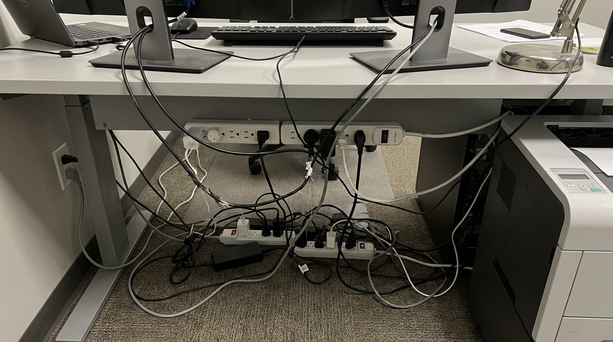

Office buildings and corporate workplaces require specialist fire risk assessments that address modern working patterns including hot-desking, hybrid working, server room infrastructure, and lithium-ion battery risks. Under the Regulatory Reform (Fire Safety) Order 2005, the responsible person for the building must ensure that adequate fire safety measures are in place, and since October 2023, all businesses must document their fire risk assessments in writing regardless of employee numbers.

## Serving Offices & Corporate Buildings Across the UK

We work with facilities managers, building owners, and corporate compliance officers responsible for all types of office environments:

- **Traditional offices** — single-floor and multi-storey buildings
- **Serviced offices & co-working spaces** — flexible workspaces with hot-desking
- **Corporate headquarters** — complex multi-floor operations
- **Mixed-use developments** — offices above retail or with commercial tenants
- **Business centres** — multi-occupancy office buildings

## Complete Office Fire Safety Assessment Package

Every office fire risk assessment includes a comprehensive package designed to meet all current legislative requirements and best practice standards:

- **Full workplace inspection** — workstations, meeting rooms, server rooms, storage, and common areas
- **Electrical equipment assessment** — load calculations, circuit capacity, PAT compliance
- **Server room & IT evaluation** — cooling redundancy, UPS battery safety, fire suppression suitability
- **Hot-desking & hybrid working review** — charging stations, variable occupancy, evacuation procedures
- **Document storage assessment** — combustible loads, clearances, detection systems
- **After-hours safety evaluation** — lone worker policies, unoccupied period detection, cleaning protocols
- **Lithium-ion battery risk assessment** — device inventory, charging safety, thermal runaway protocols
- **Detailed photographic report** — BS 7974 compliant with risk ratings and prioritised action plan
- **Ongoing compliance support** — guidance on implementing recommendations and review scheduling

## Why Office Managers Choose Fire Assessment North

Facilities managers and corporate compliance officers across the UK trust us for their offices because we understand the specific challenges of modern workplace fire safety:

- **24-hour turnaround** on standard assessments — minimising disruption to business operations
- **BAFE SP205 registered** — independently audited and accredited
- **October 2023 compliant** — following the latest mandatory documentation requirements
- **Corporate governance ready** — board-level reporting format with director liability protection
- **Multi-office portfolio support** — centralised scheduling with bulk discounts of 10-15%
- **Modern workplace specialists** — expertise in hot-desking, hybrid working, and lithium-ion risks
- **Competitive pricing** — transparent fees with no hidden costs

