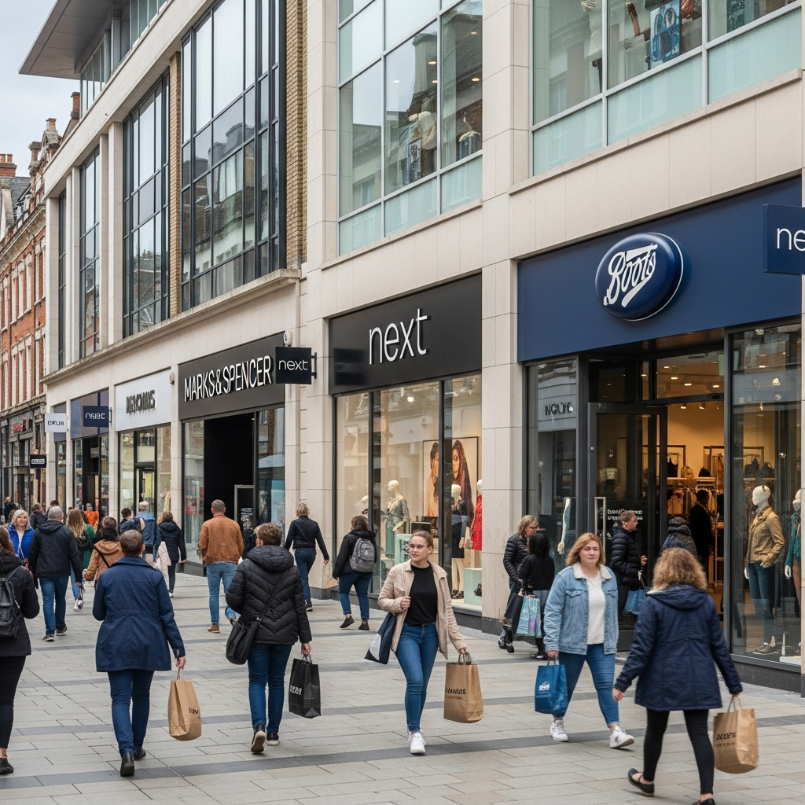
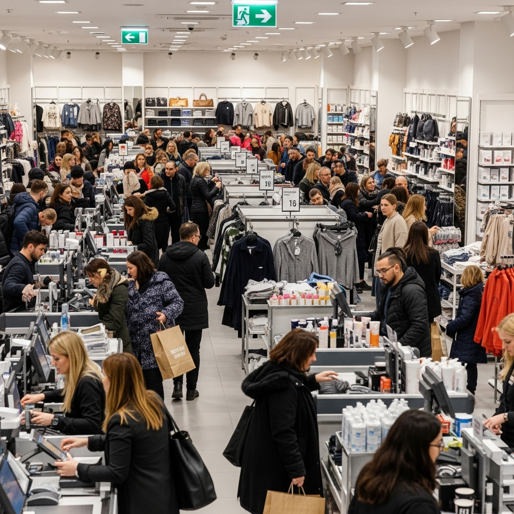

Retail shops and shopping centres require specialist fire risk assessments that address customer evacuation, seasonal display compliance, POS electrical safety, and peak trading period planning. Under the Regulatory Reform (Fire Safety) Order 2005, the responsible person for the premises must ensure that adequate fire safety measures are in place to protect customers, staff, and the public.

### Serving Retail Premises Across the UK

We work with retail operators, store managers, and compliance officers responsible for all types of retail environments:

- **High street shops** — single units and flagship stores
- **Shopping centre units** — within managed complexes
- **Department stores** — multi-floor retail operations
- **Multi-site chains** — standardised compliance across locations
- **Pop-up shops** — temporary retail premises

### Complete Retail Fire Safety Assessment Package

Every retail fire risk assessment includes a comprehensive package designed to meet all current legislative requirements and best practice standards:

- **Full store inspection** — customer areas, stockrooms, changing rooms, POS zones
- **Customer & peak period analysis** — occupancy calculations, exit capacity, crowd management
- **POS & electrical assessment** — load calculations, circuit capacity, cable management
- **Seasonal display evaluation** — fire retardancy, exit clearance, sprinkler obstruction
- **Stockroom & storage review** — combustible loads, fire door compliance, housekeeping
- **Changing room safety** — travel distances, detection, evacuation procedures
- **Detailed photographic report** — compliant with risk ratings and prioritised action plan
- **Ongoing compliance support** — guidance on implementing recommendations and review scheduling

### Why Retail Operators Choose Fire Assessment North

Retail operators and store managers across the UK trust us for their premises because we understand the specific challenges of retail fire safety:

- **24-hour turnaround** on standard assessments — minimising trading disruption
- **BAFE SP205 registered** — independently audited and accredited
- **Multi-site specialists** — standardised frameworks with bulk discounts of 10-15%
- **Seasonal display expertise** — Christmas, Black Friday, and promotional event planning
- **Shopping centre coordination** — Article 22 FSO 2005 compliance support
- **Competitive pricing** — transparent fees with no hidden costs

