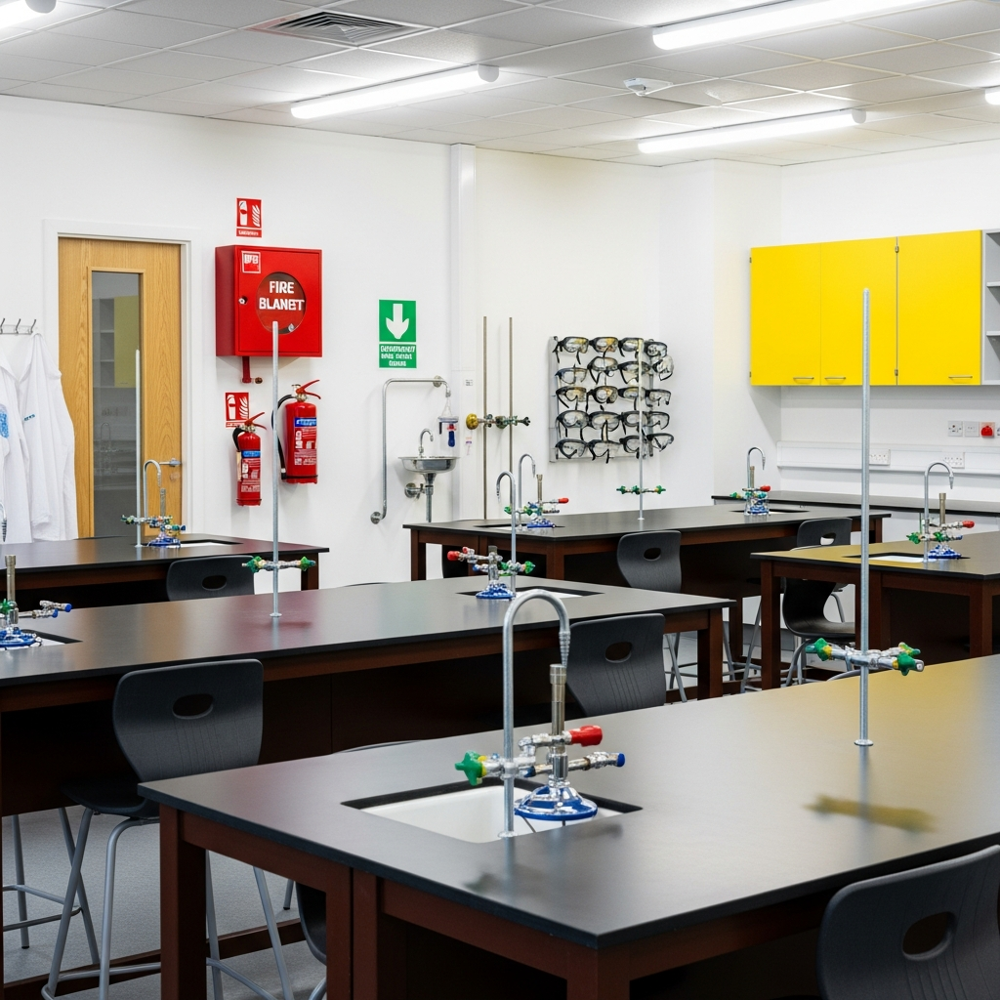
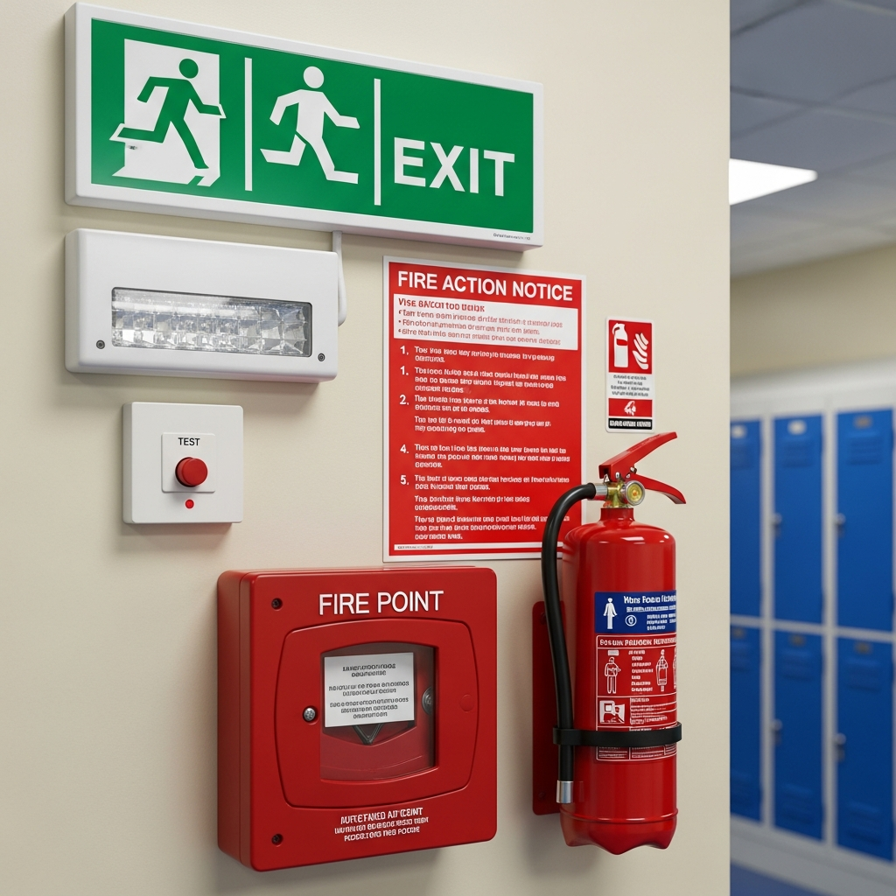

Schools and educational establishments require specialist fire risk assessments that address supervised evacuation of young persons, science laboratory safety, assembly hall capacity, and disabled pupil PEEPs. Under the Regulatory Reform (Fire Safety) Order 2005 and Department for Education guidance, schools must maintain comprehensive fire safety documentation meeting Ofsted inspection standards.

## Serving Schools & Educational Establishments Across the UK

We work with headteachers, governors, and compliance officers responsible for all types of educational premises:

- **Primary schools** — nursery and infant/junior facilities
- **Secondary schools** — including science labs and workshops
- **Academies & multi-academy trusts** — coordinated trust-wide compliance
- **SEN schools** — enhanced PEEP requirements for special educational needs
- **Sixth form colleges** — including vocational and laboratory facilities

## Complete School Fire Safety Assessment Package

Every school fire risk assessment includes a comprehensive package designed to meet all current legislative requirements and Ofsted inspection standards:

- **Full school inspection** — classrooms, labs, assembly halls, sports facilities, and after-school clubs
- **CLEAPSS science lab assessment** — Bunsen burner safety, chemical storage, gas tubing compliance
- **Building Bulletin 100 verification** — assembly hall occupancy, exit capacity, emergency lighting
- **Disabled pupil PEEPs** — evacuation chairs, refuge areas, staff training, Equality Act compliance
- **Kitchen Class F assessment** — wet chemical extinguishers, BS EN 3 compliance, extraction cleaning
- **Arson prevention review** — security measures, combustible material management
- **Detailed photographic report** — Ofsted-ready with risk ratings and prioritised action plan
- **Ongoing compliance support** — termly drill schedules and review guidance

## Why Schools Choose Fire Assessment North

Headteachers and governors across the UK trust us for their schools because we understand the specific challenges of educational fire safety:

- **24-hour turnaround** on standard assessments — Ofsted inspection ready
- **BAFE SP205 registered** — independently audited and accredited
- **Ofsted-ready documentation** — safeguarding and leadership framework compliance
- **CLEAPSS & Building Bulletin 100 specialists** — education-specific expertise
- **Multi-academy trust support** — standardised frameworks with bulk discounts of 10-15%
- **PEEP development** — for all categories of disabled pupils

