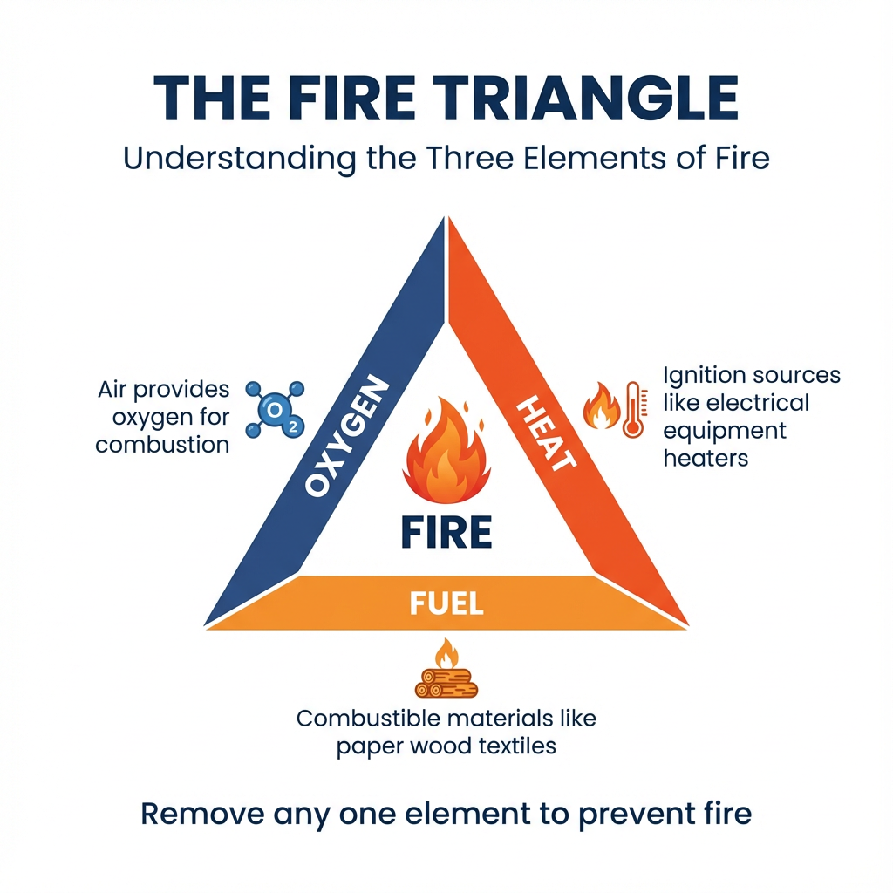
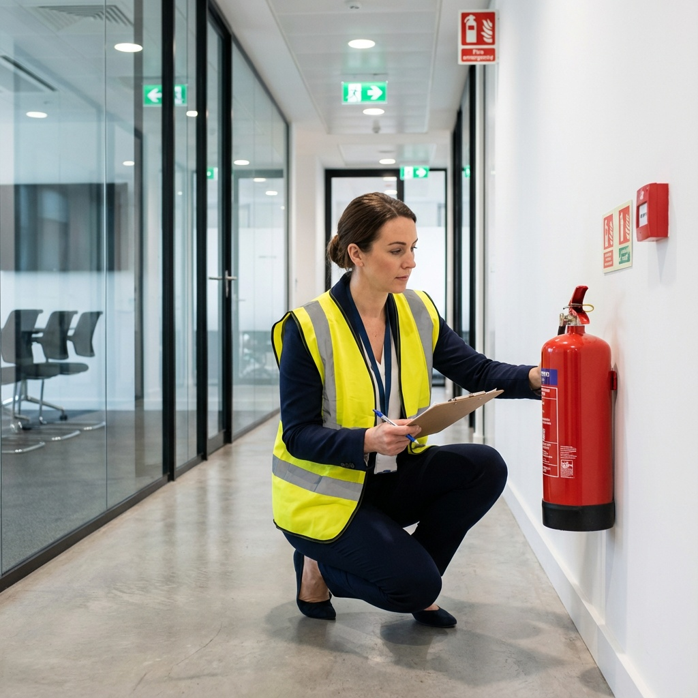
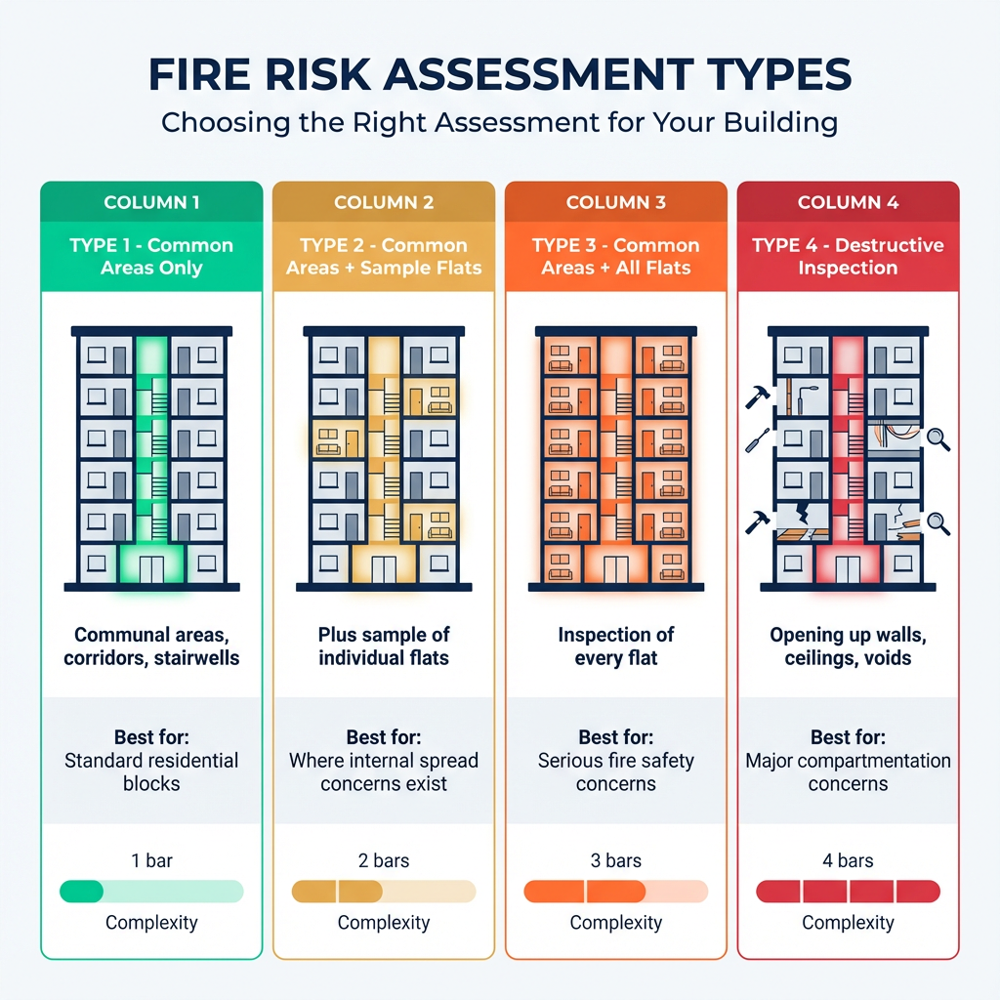

## What is a Fire Risk Assessment?

### Definition

A **fire risk assessment** is a systematic evaluation of your premises to identify fire hazards, assess risks to people, and determine what fire safety measures are needed. It is a **legal requirement** under the Regulatory Reform (Fire Safety) Order 2005 for all non-domestic premises in England and Wales.

The purpose of a fire risk assessment is to ensure that everyone in your building can escape safely in the event of a fire. It examines potential sources of ignition, fuel, and oxygen (the fire triangle), identifies who might be at risk, and evaluates whether existing fire safety measures are adequate.

### What Does a Fire Risk Assessment Include?

A comprehensive fire risk assessment examines:

- **Fire hazards:** Sources of ignition (electrical equipment, heating, cooking), fuel sources (paper, textiles, flammable liquids), and oxygen sources
- **People at risk:** Employees, visitors, contractors, and especially vulnerable people who may need assistance evacuating
- **Fire detection and warning systems:** Smoke detectors, fire alarms, and their maintenance
- **Escape routes:** Emergency exits, corridors, stairways, and external routes
- **Fire doors:** Their condition, certification, and proper operation
- **Emergency lighting:** Functionality and coverage
- **Firefighting equipment:** Fire extinguishers, blankets, and sprinkler systems
- **Signage:** Fire exit signs, fire action notices, and assembly point signs
- **Staff training:** Fire safety awareness and evacuation procedures

### Key Requirements for 2026

- Written fire risk assessment required for all premises with 2+ domestic units (Building Safety Act 2022)
- Quarterly fire door checks in buildings over 11 metres
- External wall assessments for high-rise buildings
- Personal Emergency Evacuation Plans (PEEPs) for residents who need assistance (from April 2026)
- Assessor competency requirements under BS 8674:2025

### Types of Fire Risk Assessment

Fire risk assessments are categorised into four types under PAS 79-1:

- **Type 1 – Common Areas Only:** Assesses communal parts without inspecting flats. Suitable for most residential blocks.
- **Type 2 – Common Areas + Sample Flats:** Includes inspection of a sample of flats to assess fire spread risks.
- **Type 3 – Common Areas + All Flats:** Full inspection of every flat. Required where serious concerns exist.
- **Type 4 – Destructive Inspection:** Includes opening up construction to inspect hidden voids and compartmentation.

For commercial premises, the type depends on complexity and risk level. Simple offices may need only a basic assessment, while industrial premises with hazardous materials require more detailed evaluation.

